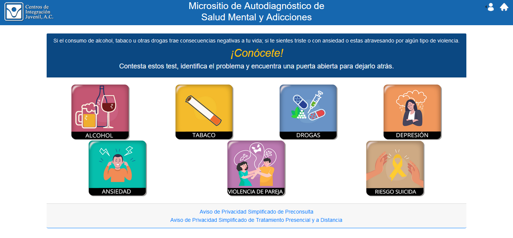

```{r setup, include=TRUE, echo = FALSE, warning = FALSE, message = FALSE}
knitr::opts_chunk$set(echo = FALSE)
setwd("C:/Users/inp.mx/Documents/Tavarich/2022/Autodiagnosticos/Informe_final2")

library(gt)
library(tidyverse)
library(viridis)

source("./Scripts/clean_depre.R")
source("./Scripts/clean_ansi.R")

menor18d <- subset(depre, EDAD > 13 & EDAD < 18 & date < as.Date("19/06/2022", "%d/%m/%Y"))
ad1825d <- subset(depre, EDAD > 17 & EDAD < 26 & date < as.Date("19/06/2022", "%d/%m/%Y"))
ad2645d <- subset(depre, EDAD > 25 & EDAD < 46 & date < as.Date("19/06/2022", "%d/%m/%Y"))
ad4659d <- subset(depre, EDAD > 45 & EDAD < 60 & date < as.Date("19/06/2022", "%d/%m/%Y"))
ad60d <- subset(depre, EDAD > 59 & date < as.Date("19/06/2022", "%d/%m/%Y"))

menor18a <- subset(ansi, EDAD > 13 & EDAD < 18 & date < as.Date("19/06/2022", "%d/%m/%Y")) # 346,406 o 39.57% de la muestra
ad1825a <- subset(ansi, EDAD > 17 & EDAD < 26 & date < as.Date("19/06/2022", "%d/%m/%Y"))
ad2645a <- subset(ansi, EDAD > 25 & EDAD < 46 & date < as.Date("19/06/2022", "%d/%m/%Y"))
ad4659a <- subset(ansi, EDAD > 45 & EDAD < 60 & date < as.Date("19/06/2022", "%d/%m/%Y"))
ad60a <- subset(ansi, EDAD > 59 & date < as.Date("19/06/2022", "%d/%m/%Y"))

depre2 <- subset(depre, EDAD > 14 & date < as.Date("19/06/2022",'%d/%m/%Y'))

ansi2 <- subset(ansi, EDAD > 14 & date < as.Date("19/06/2022",'%d/%m/%Y'))
```

\newpage

# Introducción

Los trastornos mentales son importantes problemas de salud pública a nivel mundial, tanto por los efectos que ocasionan a la población, como por los costos económicos, sanitarios y sociales que producen. De acuerdo con el estudio de Carga Global de Enfermedad (IHME, 2022), en 2019 los problemas de salud mental estuvieron entre las diez primeras causas de carga de enfermedad, siendo responsables de 125.3 millones de Años de Vida Saludables (AVISAS) perdidos[^1], lo que equivale al 5.1% del total de AVISAS perdidos durante ese año.

[^1]: Los AVISAS perdidos representan una medida de pérdida de salud, y se componen de la suma de los años de vida perdidos por muerte prematura (APMP) asociados a una enfermedad, factor de riesgo o condición de salud, más los años de vida vividos con discapacidad (AVD) asociados a una enfermedad, factor de riesgo o condición de salud en una población determinada

A pesar de su impacto, la Organización Mundial de la Salud (2022) ha reconocido que existe a nivel mundial una baja cobertura de atención por parte de los servicios de salud. Además los eventos recientes como la pandemia de Covid-19 (Santomauro et al., 2021; Sorkin et al., 2021) o los conflictos armados (Bai et al., 2022) han exacerbado los problemas de salud mental de la población, por lo que se ha vulto necesario el desarrollo de intervenciones novedosas que permitan extender la cobertura de los servicios de salud mental.

## Herramientas de *eSalud* y salud mental.

El uso de las Tecnologías de la Información y Comunicación (TICs) aplicadas a la salud (*eSalud*) ha abierto un abanico de nuevas posibilidades para la prevención, atención e investigación en salud mental. 

La *eSalud* (o *eHealth* en inglés) se define cómo el uso costo-efectivo y seguro de las TICs en apoyo de la salud y de los ámbitos relacionados con la misma, incluyendo servicios de atención sanitaria, vigilancia de salud, literatura y educación, conocimiento e investigación, entre otros; e incluyen una serie de intervenciones que van desde el uso de dispositivos conectados a internet (como acelerómetros para mediar actividad física, o autoregistros aplicados a través del celular), la inteligencia artificial aplicada al diagnóstico y tratamiento, la prestación de servicios médicos en modalidad virtual o en linea, entre muchos otros (OPS, 2016).

En los últimos años ha crecido a nivel mundial el uso de estas intervenciones, así como la evidencia de su efectividad (Deady et al., 2017). Sin embargo, la literatura señala la necesidad de su monitoreo y evaluación, a fin de asegurar que su uso aporta beneficios a los usuarios (Grigsby et al., 2005; Whetton, 2005).

Uno de los ámbitos donde se utilizan las intervenciones en línea es en la implementación de estrategias SBIRT[^2]. Éstas son consideradas como una estrategia integral y de salud pública para la detección temprana y tratamiento de personas en entornos de atención primaria en salud (García-Couceiro et al., 2021), y cada vez existe mayor evidencia de su efectividad para atender problemas de salud mental y consumo de alcohol, tabaco y otras sustancias.

[^2]: Siglas en inglés de diagnóstico, intervención breve y referencia a tratamiento

Se ha visto que las intervenciones SBIRT en línea pueden aumentar el bienestar autopercibido, reducen los síntomas de enfermedad mental y mejoran características de la vida social, como el trabajo o el funcionamiento social (Sin et al., 2020). Hensel y cols. (2019) describieron que las intervenciones en línea pueden mejorar los puntajes de ansiedad y depresión durante el seguimiento, y su uso en el primer nivel se ha asociado a un incremento en el número de pacientes identificados, y al aumento en la motivación de los pacientes para continuar con su tratamiento (Whitton et al., 2021).

Por ejemplo, Jacobson y cols. (2022) encontraron que el uso de una herramienta de diagnóstico en línea (primer componente de la intervención SBIRT) aumentó la probabilidad de los usuarios de hacer búsquedas en internet relacionadas con salud mental, prestadores de servicios de salud mental o efectos de las sustancias psicoactivas, entre otros.

Sin embargo, el desarrollo de intervenciones SBIRT en modalidad en línea aún se encuentran en fase de desarrollo, ya que su implementación implica retos importantes en la atención tanto para los usuarios como para los especialistas de salud que las utilizan. Por ejemplo, un estudio de Amerigen y cols. (2015) mostró que las personas que mantuvieron adherencia a una estrategia de tratamiento en línea tenían mayor probabilidad de tener un diagnóstico previo (como ansiedad, trastorno obsesivo-compulsivo, estrés postraumático, depresión, discapacidad o estrés por carga familiar), lo que sugiere que las personas que experimentan un problema de salud mental, o son usuarios de servicios de salud mental podrían tener mayor demanda de esta modalidad de serivicios.

Otro estudio encontró que la implementación de un sistema de autodiagnóstico y referencia en línea de salud mental para estudiantes universitarios impulsó a un 75% de los estudiantes a decidirse a buscar apoyo profesional (en cualquier modalidad) y 68% solicitaron una cita presencial para acudir a servicios de salud mental en el campus (Kim et al., 2011), lo que pone de manifiesto la importancia del vinculo entre la prestación de servicios de salud en línea y presenciales.

## Factores asociados al uso de intervenciones en línea.

Lo anterior hace más evidente que las intervenciones en línea (como es el caso del diagnóstico en línea) no solamente dependen del desarrollo tecnológico, sino que cada vez resulta más necesario entender como contribuyen las características del usuario y su interacción con la herramienta para obtener un beneficio terapéutico (Sánchez Huesca & Templos Núñez, 2021).

Por ello, la evaluación de un proyecto de *eSalud* (como las intervenciones en línea) debe considerar, además de la tecnología utilizada para su desarrollo, cuestiones como la gobernanza[^3], la integración de la herramienta con el sistema de salud y el apoyo que le brinden las instituciones y los profesionales de la salud al usuario en esta modalidad terapeútica, entre otras (OPS, 2016).

[^3]: Entendida como el impulso que se le dé a las estrategias de *eSalud* través del desarrollo e implementación de políticas públicas (como regulaciónes, programas y prestación de servicios de apoyo)

En la actualidad la investigación está buscando describir y entender los factores relacionados con el uso de herramientas de *eSalud*. El estudio de de Veer y cols. (2015), por ejemplo, señaló que los adultos mayores poseen buena predisposición para usar dichas herramientas (63.1% considerarían usarlas), y que la facilidad de uso y de aprendizaje de la herramienta son elementos potenciadores de su uso, mientras que mayor edad y bajas expectativas del desempeño actuan como barreras para el uso de la misma. Alam y cols. (2019) por su parte, describieron que ser de mediana edad, pertenecer a una familia de 3 a 4 miembros y el alfabetismo digital son factores que aumentan la probabilidad de uso de herramientas de *eSalud*. 

Otros factores sociodemográficos que también se han descrito son mayor nivel educativo e ingreso y el acceso a la tecnología (Ali et al., 2021; Kesse-Tachi et al., 2019). Lara y cols. (2022) encontraron que ser mujer, ser mayor de edad, tener trabajo remunerado, no haber estado en terapia y no haber intentado suicidarse, son factores que se relacionan con mayor aceptación del uso de estas herramientas.

Sin embargo, Martínez y cols. (2018) refirieron que las intervenciones en línea, aunque fueron referidas como útiles y aceptables, tienen en general bajo nivel de uso, lo que apunta a la necesidad de realizar evaluaciones de la misma, para mejorar su diseño, proceso de implementación y resultados; y con ello aumentar el uso y retención por parte de los usuarios. Además, para que una herramienta de *eSalud* cumpla efectivamente con su función, se debe considerar incluir otros elementos que motiven a los usuarios a involucrarse y trabajar con ella (Lüttke et al., 2018).

## Antecedentes del problema

La depresión es uno de los principales problemas de salud mental en nuestro país. Se estimó que en 2010 alrededor de una décima parte de la población mexicana (9.2%) sufrió alguna clase de trastorno afectivo, como depresión o distimia, durante su vida; y 4.8% de la población experimentó algún trastorno afectivo en el último año (Berenzon y cols., 2013). Estos trastornos se presentan en mayor proporción en mujeres que en hombres, como lo señala Rafful y colaboradores, quienes han descrito la prevalencia de depresión en mujeres de 45 a 54 años en 13.1 % alguna vez en la vida y 12.9 % en los últimos 12 meses, con episodios de 6.2 años de duración en promedio.

Existen diferencias importantes respecto de la prevalencia de depresión en subpoblaciones específicas. Por ejemplo, Benjet y colaboradores (2020) encontraron que los jóvenes presentan mayor riesgo de experimentar un episodio depresivo en algún momento de su vida respecto a la población general; mientras que Soria-Saucedo y cols. (2018) encontraron la misma diferencia en profesores de educación básica. Otro grupo que también se ha reportado con mayor riesgo de padecer depresión es la población indígena. Un estudio de Servan-Mori y colaboradores (2020) encontró que en adolescentes indígenas de Chiapas, la prevalencia de síntomas depresivos y ansiosos fue de 35.5%,y que éstos se asocia a condiciones de riesgo como uso de sustancias, experiencias negativas de vida o intento de suicidio.

Por otro lado, se estima que los trastornos de ansiedad son el segundo trastorno mental más frecuente en nuestro país, con una prevalencia de 14%-15% en población adulta, y alcanzando hasta 18% en población adolescente (Medina-Mora et al., 2007). Además, existe una comorbilidad muy alta de este trastorno con depresión. (Serván-Mori et al., 2021).

Como se observa, ambas patologías (ansiedad y depresión) representan un grave problema de salud mental en nuestro pais, y ante el aumento de la demanda de atención en línea de servicios de salud mental y la necesidad de atenuar el efecto de la limitación en la prestación de servicios presenciales de salud, precipitada, entre otras cosas, por el cierre de actividades derivado de la pandemia de Covid-19, los Centros de Integración Juvenil (CIJ) A. C. a través de la Dirección de Tratamiento y Rehabilitación lanzaron una herramienta de *eSalud* llamada [**Micrositio de Autodiagnóstico de Salud Mental y Adicciones**](http://www.cij.gob.mx/Autodiagnostico) la cual permite al usuario autoaplicarse un cuestionario diagnóstico (screening) para evaluar su consumo de alcohol, tabaco y drogas, así como la presencia de sintomas relacionados a problemas de salud mental, como depresión, ansiedad o riesgo suicida, para después recibir retroalimentación respecto al nivel de severidad de sus síntomas y ofrecerle diversas opciones de atención (tanto virtuales como presenciales) dentro de la red de atención de CIJ. Dicha herramienta entró en servicio el 13 de mayo de 2021 y funciona las 24 hrs. del día los 365 días del año.

## Objetivo del estudio

Caracterizar a la población usuaria de la herramienta de autodiagnóstico en línea de depresión y ansiedad de los Centros de Integración Juvenil, durante el periodo comprendido entre el 13 de febrero de 2021 y el 18 de junio de 2022.

Objetivos específicos:

1.  Descripción de las características sociodemográfica de la población usuaria de la herramienta de autodiagnóstico en línea de depresión y ansiedad de CIJ.

2.  Descripción de los perfiles de uso temporal y espacial de la herramienta de autodiagnóstico en línea de depresión y ansiedad de CIJ.

# Método

## Diseño del estudio

El presente fue un estudio descriptivo, transversal, *ex-post-facto*, de análisis secundario de registros administrativos.

## Sujetos

Se incluyeron a todos los usuarios que utilizaron la herramienta de autodiagnóstico en línea de depresión y ansiedad de CIJ en el periodo comprendido entre el 13 de febrero de 2021 y el 18 de junio de 2022. Se consideraron los siguientes criteros de exclusión y eliminación:

-   *Criterios de exclusión:* (i) Usuarios que hayan utilizado la herramienta de autodiagnóstico en línea de depresión y ansiedad de CIJ después del 19 de junio de 2022 y (ii) Usuarios menores de 14 años de edad.

-   *Criterios de eliminación:* Todos los casos con más del 10% de valores perdidos.

## Instrumentos

La herramienta de autodiagnóstico consiste en versiones electrónicas de los siguientes instrumentos clínicos:

**Depresión:** Se utilizó el Inventario de Depresión de Beck 2 versión en español (BDI-2) (Beck et al., 1996) El cual es uno de los instrumentos clínicos de auto-reporte más utilizados para evaluar depresión. Consta de 21 reactivos, que hacen referencia a procesos cognitivos o emocionales asociados a la sintomatología depresiva y que el usuario refiere haber presentado en la última semana. Los reactivos son de tipo Likert, con opciones que van desde "*En absoluto*" hasta "*Severamente, casi no podía soportarlo*".

La adaptación mexicana de la escala original mostró una consistencia interna aceptable ($\alpha$ de Cronbach = 0.87), una estructura de tres factores y validez concurrente con otras escalas de depresión (Jurado et al., 1988), y se han desarrollado escalas cortas a partir de esta (Moral de la Rubia, 2013). Se utilizaron los puntos de corte descritos para la versión en español de Jurado ey colaboradores (1988): Bajo = 0-9, Leve = 10-16, Medio = 17-29 y Alto = 30-63.

Este instrumento también se ha utilizado en población adolescente (Smith et al., 2004; Teri, 1982). Sin embargo, para su uso en población adolescente, se utilizarán los puntos de corte propuestos por Dolle y cols. (2012): Bajo = 0-10, Leve = 11-22 y Medio/Alto = 23/65.

**Ansiedad:** Se utilizó Inventario de Ansiedad de Beck (BAI) (Beck et al., 1988), el cual también es uno de los instrumentos clínicos de auto-reporte más utilizados para evaluar ansiedad. Consta de 21 reactivos, que hacen referencia a procesos cognitivos o emocionales asociados a la sintomatología ansiosa que el usuario refiere haber tenido en la última semana, con respuestas tipo Likert que van desde *"En absoluto"* hasta *"Severamente"*, casi no podía soportarlo". La versión original reporta una consistencia interna alta ($\alpha$ de Cronbach = 0.92), confiabilidad test-retest = 0.75 y con capacidad de discriminar a personas con diagnóstico de trastornos de ansiedad respecto a otro tipo de trastornos.

La versión en español ha mostrado tener buenas propiedades psicométricas, aunque aún se mantiene activa la discusión sobre la estructura factorial del mismo, ya que se ha señalado ajuste a modelos de uno (Vizioli & Pagan, 2021), dos (Estrada Aranda et al., 2014; Padrós Blázquez et al., 2020), tres (González et al., 2015) y más factores (Osman et al., 2017). También se ha estandarizado en subpoblaciones mexicanas como pacientes asmáticos (Díaz-Barriga & González-Celis Rangel, 2019) y con cáncer (Galindo Vázquez et al., 2015).

Este instrumento se ha utilizado también en población adolescente (Jolly et al., 1993; Kumar et al., 1993; Steer et al., 1995) sin haber reportado diferencias en los puntos de corte respecto de lor reportados en población adulta.

## Procedimiento

Los usuarios acceden a la dirección electrónica <http://www.cij.gob.mx/Autodiagnostico>, en donde están disponibles los instrumentos de depresión y ansidedad (Figura 1).

{width="75%"}

Una vez seleccionado el instrumento de su interés, los usuarios responden al cuestionario en línea de depresión/ansiedad, capturan sus datos sociodemográfico (edad, sexo, si pertenece a la comunidad LGBT+ y si pertenece a algún grupo indígena), y posteriormente la herramienta retroalimenta al usuario respecto de la severidad de sus síntomas y le ofrece diversas opciones de atención (tanto virtuales como presenciales) dentro de la red de 120 centros de tratamiento de CIJ.

## Consideraciones éticas

El presente estudio se realizó con estricto apego al Reglamento de la Ley General de Salud en Materia de Investigación en Salud, con relación a los Aspectos Éticos de la Investigación en Seres Humanos.

-   Respecto al *anonimato de los participantes* y la *confidencialidad de las respuestas*, y considerando que la herramienta está disponible en la web para su consulta, los cuestionarios no solicitan datos personales y/o de identificación a ningún participante.

-   Respecto al tratamiento de los *datos de identificación* de aquellos usuarios que los registraron voluntariamente para ser contactados por personal de salud de la institución, dichos registros fueron de-identificados[^4] antes de hacer los análisis estadísticos correspondientes.

[^4]: La de-identificación es un proceso sistemático que consiste en la eliminación o enmascaramiento (a través de un algorítmo estadístico) de la información clínica personal, a fin de evitar que el usuario pueda ser reconocido.

## Plan de análisis de resultados

Se realizó un análisis exploratorio de las bases de datos, así como la limpieza y recodificación de las variables disponibles.

Para analizar las características de los usuarios de la herramienta de autodiagnóstico de depresión y ansiedad, se examinó la prevalencia (frecuencia) de los niveles de sintomatología ansiosa y depresiva (leve, bajo, medio, alto) por grupo de edad (considerando a los grupos de 14 a 17 años,18 a 25 años, 26 a 45 años, 46 a 59 años y mayores de 60 años). Posteriormente se analizó la prevalencia de los niveles de sintomatología ansiosa y depresiva por grupo de edad considerando el sexo, la condición de LGBT+ y la condición de indigenismo. Las diferencias entre grupos de edad se analizarán a través de una prueba $\chi^2$.

Para realizar el análisis del patrón de uso espacial (frecuencia y tendencias de uso a nivel de entidad federativa) se realizaron mapas coropléticos de los usuarios de la plataforma de autodiagnóstico de depresión y ansiedad por entidad federativa y año para el análisis de uso temporal se cuantificó la proporción de usuarios de la plataforma por día del año, por mes del año, por día de la semana y por día y hora de la semana.

Los análisis estadísticos se realizaron utilizando el lenguaje de programación R versión 4.2.1 (R Core Team, 2022) y el IDE R Studio versión 2022.07.1.554 (RStudio Team, 2022).

\newpage

# Resultados

## **Depresión**

### Perfil de los usuarios de la herramienta de depresión por grupo de edad

```{r sev_dep, warning = FALSE}
#Obtenemos prevalencia de severidad en los menores de 18 años
t1_dep18 <- as.data.frame(table(menor18d$RESULTADO))
names(t1_dep18) <- c("nivel","n_18d")
t1_dep18$prop_18d <- round((t1_dep18$n_18d/sum(t1_dep18$n_18d))*100, digits = 1)
#Obtenemos prevalencia de severidad en el grupo de 18 a 25 años
t1_dep25 <- as.data.frame(table(ad1825d$RESULTADO))
names(t1_dep25) <- c("nivel","n_25d")
t1_dep25$prop_25d <- round((t1_dep25$n_25d/sum(t1_dep25$n_25d))*100, digits = 1)
#Obtenemos prevalencia de severidad en el grupo de 26 a 45 años
t1_dep45 <- as.data.frame(table(ad2645d$RESULTADO))
names(t1_dep45) <- c("nivel","n_45d")
t1_dep45$prop_45d <- round((t1_dep45$n_45d/sum(t1_dep45$n_45d))*100, digits = 1)
#Obtenemos prevalencia de severidad en el grupo de 46 a 59 años
t1_dep59 <- as.data.frame(table(ad4659d$RESULTADO))
names(t1_dep59) <- c("nivel","n_59d")
t1_dep59$prop_59d <- round((t1_dep59$n_59d/sum(t1_dep59$n_59d))*100, digits = 1)

t1_dep60 <- as.data.frame(table(ad60d$RESULTADO))
names(t1_dep60) <- c("nivel","n_60d")
t1_dep60$prop_60d <- round((t1_dep60$n_60d/sum(t1_dep60$n_60d))*100, digits = 1)

#Creamos la tabla con las columnas compartidas
t1_sevd <- merge( t1_dep18, t1_dep25, by = "nivel")
t1_sevd <- merge( t1_sevd, t1_dep45, by = "nivel")
t1_sevd <- merge( t1_sevd, t1_dep59, by = "nivel")
t1_sevd <- merge( t1_sevd, t1_dep60, by = "nivel")
t1_sevd$nivel <- factor(t1_sevd$nivel, levels = c("Bajo", "Leve", "Medio", "Alto"))
t1_sevd$total <- t1_sevd$n_18d + t1_sevd$n_25d + t1_sevd$n_45d + t1_sevd$n_59d + t1_sevd$n_60d
t1_sevd$prop <- format(t1_sevd$total/sum(t1_sevd$total)*100, digits = 3)

t1_chi <- chisq.test(x = matrix(data = c(t1_sevd$n_18d, t1_sevd$n_25d,
                                         t1_sevd$n_45d, t1_sevd$n_59d,
                                         t1_sevd$n_60d), ncol = 5))

t1_chi2 <- paste0("Chi2 = ",format(t1_chi$statistic, nsmall = 3), "; ", 
                  "df = ", t1_chi$parameter, "; ", 
                  "valor p = ", format(t1_chi$p.value, nsmall = 5, scientific = TRUE))
```

Antes de analizar las diferencias en el nivel de la sintomatología depresiva, es importante describir el uso general de la plataforma por parte de los usuarios de los distintos grupos de edad. 

El grupo de 14 a 17 años fue el que hizo un mayor uso de la herramienta, con `r format((sum(t1_sevd$n_18d)/sum(t1_sevd$total)*100), digits = 3)`% del total de las visitas, seguidas por el grupo de 17 a 25 años (`r format((sum(t1_sevd$n_25d)/sum(t1_sevd$total))*100, digits = 3)`%), después el grupo de 26 a 45 años (`r format((sum(t1_sevd$n_45d)/sum(t1_sevd$total))*100, digits = 3)`%), el grupo de 46 a 59 años (`r format((sum(t1_sevd$n_59d)/sum(t1_sevd$total))*100, digits = 2)`%) y finalmente el grupo de más de 60 años (`r format((sum(t1_sevd$n_60d)/sum(t1_sevd$total))*100, digits = 1)`% del total de las visitas).

#### a) Por nivel de severidad

El análisis de la prevalencia de los diferentes niveles de sintomatología depresiva por grupo de edad de la herramienta de autodiagnóstico se muestra a continuación en la Tabla 1:

```{r sev_dep_table, warning = FALSE}
#Imprimimos la tabla
t1_sevd %>% arrange(factor
                    (nivel, levels = c("Bajo", "Leve", "Medio", "Alto"))) %>%
  gt() %>% 
  tab_header( title = "Tabla 1: Niveles de depresión.", 
              subtitle = "Usuarios de la plataforma de autodiagnóstico de CIJ, 2021-2022") %>%
    tab_spanner( label = "< 18 años", 
                 columns = c(n_18d, prop_18d)) %>%
    tab_spanner( label = "18 a 25 años", 
                 columns = c(n_25d, prop_25d)) %>% 
    tab_spanner( label = "26 a 45 años", 
                 columns = c(n_45d, prop_45d)) %>%
    tab_spanner( label = "46 a 59 años", 
                 columns = c(n_59d, prop_59d)) %>% 
    tab_spanner( label = "> 60 años", 
                 columns = c(n_60d, prop_60d)) %>%
    tab_spanner( label = "Total", 
                 columns = c(total, prop)) %>% 
  cols_label(nivel = "Nivel depresión",
             n_18d = "n", prop_18d = "%",
             n_25d = "n", prop_25d = "%",
             n_45d = "n", prop_45d = "%",
             n_59d = "n", prop_59d = "%",
             n_60d = "n", prop_60d = "%",
             total = "n", prop = "%") %>%
  tab_source_note(source_note = t1_chi2) %>%
  summary_rows( groups = NULL, 
                columns = c(n_18d, n_25d, n_45d, n_59d, n_60d, total), 
                fns = list(Total = ~sum(.)), formatter = fmt_number, 
                use_seps = FALSE, decimal = 0)

```

Al analizar el nivel de sintomatología depresiva, se encontró que en promedio `r format(x = sum(t1_sevd$total[t1_sevd$nivel == "Alto"], t1_sevd$total[t1_sevd$nivel == "Medio"])/sum(t1_sevd$total)*100, digits = 3)`% de los usuarios presentaron sintomatología media-alta, teniendo diferencias importantes y estadísticamente significativas entre los diferentes grupos de edad.

En el grupo de menores de 18 años `r t1_sevd$prop_18d[t1_sevd$nivel == "Alto"] + t1_sevd$prop_18d[t1_sevd$nivel == "Medio"]`% presentaron sintomatología depresiva en rangos medio-alto, y este número aumentó a `r t1_sevd$prop_25d[t1_sevd$nivel == "Alto"] + t1_sevd$prop_25d[t1_sevd$nivel == "Medio"]`% en el grupo de jóvenes de 18 a 25 años, nivel que se mantuvo relativamente sin cambio en los adultos jóvenes (`r t1_sevd$prop_45d[t1_sevd$nivel == "Alto"] + t1_sevd$prop_45d[t1_sevd$nivel == "Medio"]`% para el grupo de 26 a 45 años).

Posteriormente se presentó una tendencia a la baja en la prevalencia de sintomatología depresiva  media-alta (`r t1_sevd$prop_59d[t1_sevd$nivel == "Alto"] + t1_sevd$prop_59d[t1_sevd$nivel == "Medio"]`% en el grupo de 46 a 59 años y `r t1_sevd$prop_60d[t1_sevd$nivel == "Alto"] + t1_sevd$prop_60d[t1_sevd$nivel == "Medio"]`% de adultos mayores de 60 años). Las diferencias entre los distintos grupos de edad fueron estadísticamente significativas, con un valor p \< 0.001, como se puede apreciar en el pie de la Tabla 1.

#### b) Por nivel de severidad y sexo  

La severidad de los síntomas depresivos asociados al sexo entre los diferentes grupos de edad se presenta a continuación en la Tabla 2.

```{r sevsex_dep, warning = FALSE}
#Obtenemos prevalencia de severidad x sexo en los menores de 18 años
t2_dep18 <- as.data.frame(table(menor18d$sexo, menor18d$RESULTADO))
names(t2_dep18) <- c("sexo", "nivel", "n_18")
t2_dep18 <- t2_dep18 %>% group_by(sexo) %>% 
  mutate(prop_18 = round(proportions(n_18)*100, digits = 1)) %>% 
  ungroup
t2_dep18$id <- paste(t2_dep18$nivel, t2_dep18$sexo, sep="-")
#Obtenemos prevalencia de severidad x sexo en el grupo de 18 a 25 años
t2_dep25 <- as.data.frame(table(ad1825d$sexo, ad1825d$RESULTADO))
names(t2_dep25) <- c("sexo", "nivel", "n_25")
t2_dep25 <- t2_dep25 %>% group_by(sexo) %>% 
  mutate(prop_25 = round(proportions(n_25)*100, digits = 1)) %>% 
  ungroup
t2_dep25$id <- paste(t2_dep25$nivel, t2_dep25$sexo, sep="-")
#Obtenemos prevalencia de severidad en el grupo de 26 a 45 años
t2_dep45 <- as.data.frame(table(ad2645d$sexo, ad2645d$RESULTADO))
names(t2_dep45) <- c("sexo", "nivel", "n_45")
t2_dep45 <- t2_dep45 %>% group_by(sexo) %>% 
  mutate(prop_45 = round(proportions(n_45)*100, digits = 1)) %>% 
  ungroup
t2_dep45$id <- paste(t2_dep45$nivel, t2_dep45$sexo, sep="-")
#Obtenemos prevalencia de severidad en el grupo de 46 a 59 años
t2_dep59 <- as.data.frame(table(ad4659d$sexo, ad4659d$RESULTADO))
names(t2_dep59) <- c("sexo", "nivel", "n_59")
t2_dep59 <- t2_dep59 %>% group_by(sexo) %>% 
  mutate(prop_59 = round(proportions(n_59)*100, digits = 1)) %>% 
  ungroup
t2_dep59$id <- paste(t2_dep59$nivel, t2_dep59$sexo, sep="-")
#Obtenemos prevalencia de severidad en el grupo de mayores de 60 años
t2_dep60 <- as.data.frame(table(ad60d$sexo, ad60d$RESULTADO))
names(t2_dep60) <- c("sexo", "nivel", "n_60")
t2_dep60 <- t2_dep60 %>% group_by(sexo) %>% 
  mutate(prop_60 = round(proportions(n_60)*100, digits = 1)) %>% 
  ungroup
t2_dep60$id <- paste(t2_dep60$nivel, t2_dep60$sexo, sep="-")

#Creamos la tabla con las columnas compartidas
t2_dep <- merge(t2_dep18, t2_dep25, by = "id")
t2_dep$sexo.y <- NULL
t2_dep$nivel.y <- NULL
t2_dep <- merge( t2_dep, t2_dep45, by = "id")
t2_dep$sexo <- NULL
t2_dep$nivel <- NULL
t2_dep <- merge( t2_dep, t2_dep59, by = "id")
t2_dep$sexo <- NULL
t2_dep$nivel <- NULL
t2_dep <- merge( t2_dep, t2_dep60, by = "id")
t2_dep$sexo <- NULL
t2_dep$nivel <- NULL
t2_dep$id <- NULL

t2_dep$total <- t2_dep$n_18 + t2_dep$n_25 +   t2_dep$n_45 + 
  t2_dep$n_59 + t2_dep$n_60


h <- sum(t2_dep$total[t2_dep$sexo.x == "Hombre"])
m <- sum(t2_dep$total[t2_dep$sexo.x == "Mujer"])
o <- sum(t2_dep$total[t2_dep$sexo.x == "Otro"])

t2_dep$prop <- NA
t2_dep$sum[t2_dep$sexo.x == "Hombre"] <-  h
t2_dep$sum[t2_dep$sexo.x == "Mujer"] <-  m
t2_dep$sum[t2_dep$sexo.x == "Otro"] <-  o

t2_dep$prop <- NA
t2_dep$prop <- format((t2_dep$total/t2_dep$sum)*100, digits = 2)
t2_dep$sum <- NULL

h2 <- subset(t2_dep, sexo.x == "Hombre")
t2_chi2h <- chisq.test(matrix(data = c(h2$n_18, h2$n_25, h2$n_45, h2$n_59, h2$n_60), ncol = 5))

tx2_chi2h <- paste0("Chi2 Hombre= ",format(t2_chi2h$statistic, nsmall = 3), 
                   "; ", "df = ", t2_chi2h$parameter, "; ", 
                   "valor p = ", format(t2_chi2h$p.value, nsmall = 5,
                                        scientific = TRUE))

m2 <- subset(t2_dep, sexo.x == "Mujer")
t2_chi2m <- chisq.test(matrix(data = c(m2$n_18, m2$n_25, m2$n_45, 
                                       m2$n_59, m2$n_60), ncol = 5))

tx2_chi2m <- paste0("Chi2 Mujer= ",format(t2_chi2m$statistic, nsmall = 3), 
                   "; ", "df = ", t2_chi2m$parameter, "; ", 
                   "valor p = ", format(t2_chi2m$p.value, nsmall = 5,
                                        scientific = TRUE))

o2 <- subset(t2_dep, sexo.x == "Otro")
t2_chi2o <- chisq.test(matrix(data = c(o2$n_18, o2$n_25, o2$n_45, 
                                       o2$n_59, o2$n_60), ncol = 5))

tx2_chi2o <- paste0("Chi2 Otro= ",format(t2_chi2o$statistic, nsmall = 3), 
                   "; ", "df = ", t2_chi2o$parameter, "; ", 
                   "valor p = ", format(t2_chi2o$p.value, nsmall = 3,
                                        scientific = TRUE))

#Imprimimos la tabla

t2_dep %>% arrange(factor
                    (nivel.x, levels = c("Bajo", "Leve", "Medio", "Alto"))) %>%
  group_by(sexo.x) %>%
  gt() %>% 
  tab_header( title = "Tabla 2: Niveles de depresión por sexo.", 
              subtitle = "Usuarios de la plataforma de autodiagnóstico de CIJ, 2021-2022.") %>%
    tab_spanner( label = "< 18 años", 
                 columns = c(n_18, prop_18)) %>%
    tab_spanner( label = "18 a 25 años", 
                 columns = c(n_25, prop_25)) %>% 
    tab_spanner( label = "26 a 45 años", 
                 columns = c(n_45, prop_45)) %>%
    tab_spanner( label = "46 a 59 años", 
                 columns = c(n_59, prop_59)) %>% 
    tab_spanner( label = "> 60 años", 
                 columns = c(n_60, prop_60)) %>% 
    tab_spanner( label = "Total", 
                 columns = c(total, prop)) %>%
  cols_label(nivel.x = "Nivel depresión",
             n_18 = "n", prop_18 = "%",
             n_25 = "n", prop_25 = "%",
             n_45 = "n", prop_45 = "%",
             n_59 = "n", prop_59 = "%",
             n_60 = "n", prop_60 = "%",
             total = "n", prop = "%") %>%
  tab_source_note(source_note = tx2_chi2h) %>% 
  tab_source_note(source_note = tx2_chi2m) %>% 
  tab_source_note(source_note = tx2_chi2o) %>% 
  summary_rows( groups = TRUE, 
                columns = c(n_18, n_25, n_45, n_59, n_60, total), 
                fns = list(Total = ~sum(.)), formatter = fmt_number, 
                use_seps = FALSE, decimal = 0) %>%
  grand_summary_rows( columns = c(n_18, n_25, n_45, n_59, n_60, total), 
                fns = list(Total = ~sum(.)), formatter = fmt_number, 
                use_seps = FALSE, decimal = 0)

```

Como se muestra en el pie de la Tabla 2, hubieron diferencias estadísticamente significativas entre los distintos grupos de edad, al interior de las distintas categorias de sexo.

El grupo de *Hombres* fue el que presentó la menor prevalencia de sintomatología depresiva media-alta (`r as.numeric(h2$prop[h2$nivel.x == "Alto"]) + as.numeric(h2$prop[h2$nivel.x == "Medio"])`%) en comparación con el grupo de *Mujeres* (`r as.numeric(m2$prop[m2$nivel.x == "Alto"]) + as.numeric(m2$prop[m2$nivel.x == "Medio"])`%) y con en grupo de *Otros*[^5] (`r as.numeric(o2$prop[o2$nivel.x == "Alto"]) + as.numeric(o2$prop[o2$nivel.x == "Medio"])`%).  

[^5]: *Otros* se refiere a aquellas personas que no se identificaron como hombres o mujeres al momento de responder el cuestionario.

Este mismo patrón se observó en todos los grupos de edad, aunque la diferencia entre las distancias de las prevalencias disminuye en los grupos de mayor edad (la diferencia entre *Hombres* y *Otros* en el grupo de 14 a 17 años fue de 38.8 puntos porcentuales, mientras que esa misma diferencia en el grupo de 46 a 59 años fue de sólo 3.5 puntos porcentuales), lo que implica una mayor variabilidad en los niveles de severiedad en los grupos de edad más jóvenes.

Al analizar las trayectorias de vida, se encontró que al interior de los tres grupos hubo un aumento en la sintomatología depresiva en la juventud, y que empieza a disminuir después de los 45 años en el grupo de *Mujeres* y *Hombres*.

Por otro lado, en el grupo de *Otros*, la proporción de personas con sintomatología depresiva media-alta se mantiene relativamente constante a través de los diferentes grupos de edad (alrededor del 60%) excepto en el grupo de 46 a 59 años, donde disminuye significativamente esta proporción (44.3%).

#### c) Por niveles de severidad y condición de LGBT+   

La Tabla 3 muestra los resultados de la prevalencia de los niveles de severidad de síntomas depresivos medio-alto asociados a condición de LGBT+:

```{r sevlgbt_dep, warning = FALSE}
#Obtenemos prevalencia de severidad x sexo en los menores de 18 años
t3_dep18 <- as.data.frame(table(menor18d$LGBTI, menor18d$RESULTADO))
names(t3_dep18) <- c("lgbt", "nivel", "n_18d")
t3_dep18 <- t3_dep18 %>% group_by(lgbt) %>% 
  mutate(prop_18d = round(proportions(n_18d)*100, digits = 1)) %>% 
  ungroup
t3_dep18$id <- paste(t3_dep18$nivel, t3_dep18$lgbt, sep="-")
#Obtenemos prevalencia de severidad x sexo en el grupo de 18 a 25 años
t3_dep25 <- as.data.frame(table(ad1825d$LGBTI, ad1825d$RESULTADO))
names(t3_dep25) <- c("lgbt", "nivel", "n_25d")
t3_dep25 <- t3_dep25 %>% group_by(lgbt) %>% 
  mutate(prop_25d = round(proportions(n_25d)*100, digits = 1)) %>% 
  ungroup
t3_dep25$id <- paste(t3_dep25$nivel, t3_dep25$lgbt, sep="-")
#Obtenemos prevalencia de severidad en el grupo de 26 a 45 años
t3_dep45 <- as.data.frame(table(ad2645d$LGBTI, ad2645d$RESULTADO))
names(t3_dep45) <- c("lgbt", "nivel", "n_45d")
t3_dep45 <- t3_dep45 %>% group_by(lgbt) %>% 
  mutate(prop_45d = round(proportions(n_45d)*100, digits = 1)) %>% 
  ungroup
t3_dep45$id <- paste(t3_dep45$nivel, t3_dep45$lgbt, sep="-")
#Obtenemos prevalencia de severidad en el grupo de 46 a 59 años
t3_dep59 <- as.data.frame(table(ad4659d$LGBTI, ad4659d$RESULTADO))
names(t3_dep59) <- c("lgbt", "nivel", "n_59d")
t3_dep59 <- t3_dep59 %>% group_by(lgbt) %>% 
  mutate(prop_59d = round(proportions(n_59d)*100, digits = 1)) %>% 
  ungroup
t3_dep59$id <- paste(t3_dep59$nivel, t3_dep59$lgbt, sep="-")
#Obtenemos prevalencia de severidad en el grupo de mayores de 60 años
t3_dep60 <- as.data.frame(table(ad60d$LGBTI, ad60d$RESULTADO))
names(t3_dep60) <- c("lgbt", "nivel", "n_60d")
t3_dep60 <- t3_dep60 %>% group_by(lgbt) %>% 
  mutate(prop_60d = round(proportions(n_60d)*100, digits = 1)) %>% 
  ungroup
t3_dep60$id <- paste(t3_dep60$nivel, t3_dep60$lgbt, sep="-")

#Creamos la tabla con las columnas compartidas
t3_dep <- merge(t3_dep18, t3_dep25, by = "id")
t3_dep$lgbt.y <- NULL
t3_dep$nivel.y <- NULL
t3_dep <- merge( t3_dep, t3_dep45, by = "id")
t3_dep$lgbt <- NULL
t3_dep$nivel <- NULL
t3_dep <- merge( t3_dep, t3_dep59, by = "id")
t3_dep$lgbt <- NULL
t3_dep$nivel <- NULL
t3_dep <- merge( t3_dep, t3_dep60, by = "id")
t3_dep$lgbt <- NULL
t3_dep$nivel <- NULL
t3_dep$id <- NULL

t3_dep$total <- t3_dep$n_18 + t3_dep$n_25 +   t3_dep$n_45 + 
  t3_dep$n_59 + t3_dep$n_60

lgbt_si <- sum(t3_dep$total[t3_dep$lgbt.x == "Si"])
lgbt_no <- sum(t3_dep$total[t3_dep$lgbt.x == "No"])


t3_dep$sum <- NA
t3_dep$sum[t3_dep$lgbt.x == "Si"] <-  lgbt_si
t3_dep$sum[t3_dep$lgbt.x == "No"] <-  lgbt_no

t3_dep$prop <- NA
t3_dep$prop <- format((t3_dep$total/t3_dep$sum)*100, digits = 2)
t3_dep$sum <- NULL

h3 <- subset(t3_dep, lgbt.x == "Si")
t3_chi2si <- chisq.test(matrix(data = c(h3$n_18, h3$n_25, h3$n_45, h3$n_59, h3$n_60), ncol = 5))

tx3_chi2si <- paste0("Chi2 LGBT+ Si= ",
                     format(t3_chi2si$statistic, nsmall = 3), 
                   "; ", "df = ", t3_chi2si$parameter, "; ", 
                   "valor p = ", format(t3_chi2si$p.value, nsmall = 5,
                                        scientific = TRUE))

m3 <- subset(t3_dep, lgbt.x == "No")
t3_chi2no <- chisq.test(matrix(data = c(m3$n_18, m3$n_25, m3$n_45, 
                                        m3$n_59, m3$n_60), ncol = 5))

tx3_chi2no <- paste0("Chi2 LGBT+ No= ", 
                     format(t3_chi2no$statistic, 
                            nsmall = 3), "; ", "df = ", 
                     t3_chi2no$parameter, "; ", "valor p = ", 
                     format(t3_chi2no$p.value, nsmall = 5, 
                            scientific = TRUE))

#Imprimimos la tabla

t3_dep %>% arrange(factor
                    (nivel.x, levels = c("Bajo", "Leve", "Medio", "Alto"))) %>%
  group_by(lgbt.x) %>%
  gt() %>% 
  tab_header( title = "Tabla 3: Niveles de depresión por condición de LGBT+.", 
              subtitle = "Usuarios de la plataforma de autodiagnóstico de CIJ, 2021-2022.") %>%
    tab_spanner( label = "< 18 años", 
                 columns = c(n_18d, prop_18d)) %>%
    tab_spanner( label = "18 a 25 años", 
                 columns = c(n_25d, prop_25d)) %>% 
    tab_spanner( label = "26 a 45 años", 
                 columns = c(n_45d, prop_45d)) %>%
    tab_spanner( label = "46 a 59 años", 
                 columns = c(n_59d, prop_59d)) %>% 
    tab_spanner( label = "> 60 años", 
                 columns = c(n_60d, prop_60d)) %>% 
    tab_spanner( label = "Total", 
                 columns = c(total, prop)) %>%
  cols_label(nivel.x = "Nivel depresión",
             n_18d = "n", prop_18d = "%",
             n_25d = "n", prop_25d = "%",
             n_45d = "n", prop_45d = "%",
             n_59d = "n", prop_59d = "%",
             n_60d = "n", prop_60d = "%",
             total = "n", prop = "%") %>%
  tab_source_note(source_note = tx3_chi2no) %>%
  tab_source_note(source_note = tx3_chi2si) %>%
  summary_rows( groups = TRUE, 
                columns = c(n_18d, n_25d, n_45d, n_59d, n_60d, total), 
                fns = list(Total = ~sum(.)), formatter = fmt_number, 
                use_seps = FALSE, decimal = 0) %>%
  grand_summary_rows( columns = c(n_18d, n_25d, n_45d, n_59d, n_60d, total), 
                fns = list(Total = ~sum(.)), formatter = fmt_number, 
                use_seps = FALSE, decimal = 0)
```

Nuevamente se observó que las proporciones al interior de cada una de las categorías fueron estadísticamente significativas (valor p de la $\chi^2$ < 0.001), como se puede apreciar en el pie de la Tabla 3. 

Se encontró que las personas que refirieron estar en condición LGBT+ experimentaron mayor sintomatología depresiva media-alta con respecto de las personas que no refirieron estar en dicha condición (`r as.numeric(h3$prop[h3$nivel.x == "Alto"]) + as.numeric(h3$prop[h3$nivel.x == "Medio"])`% contra `r as.numeric(m3$prop[m3$nivel.x == "Alto"]) + as.numeric(m3$prop[m3$nivel.x == "Medio"])`%, respectivamente), y observando esta misma tendencia en todos los grupos de edad: `r as.numeric(h3$prop_18d[h3$nivel.x == "Alto"]) + as.numeric(h3$prop_18d[h3$nivel.x == "Medio"])`%, vs. `r as.numeric(m3$prop_18d[m3$nivel.x == "Alto"]) + as.numeric(m3$prop_18d[m3$nivel.x == "Medio"])`% para el grupo menor a 17 años, `r as.numeric(h3$prop_25d[h3$nivel.x == "Alto"]) + as.numeric(h3$prop_25d[h3$nivel.x == "Medio"])`% vs. `r as.numeric(m3$prop_25d[m3$nivel.x == "Alto"]) + as.numeric(m3$prop_25d[m3$nivel.x == "Medio"])`% para el grupo de 18 a 25 años, `r as.numeric(h3$prop_45d[h3$nivel.x == "Alto"]) + as.numeric(h3$prop_45d[h3$nivel.x == "Medio"])`% vs. `r as.numeric(m3$prop_45d[m3$nivel.x == "Alto"]) + as.numeric(m3$prop_45d[m3$nivel.x == "Medio"])`% para el grupo de 26 a 45 años,  `r as.numeric(h3$prop_59d[h3$nivel.x == "Alto"]) + as.numeric(h3$prop_59d[h3$nivel.x == "Medio"])`% vs. `r as.numeric(m3$prop_59d[m3$nivel.x == "Alto"]) + as.numeric(m3$prop_59d[m3$nivel.x == "Medio"])`% para el grupo de 45 a 59 años y `r as.numeric(h3$prop_60d[h3$nivel.x == "Alto"]) + as.numeric(h3$prop_60d[h3$nivel.x == "Medio"])`% vs. `r as.numeric(m3$prop_60d[m3$nivel.x == "Alto"]) + as.numeric(m3$prop_60d[m3$nivel.x == "Medio"])`% para el grupo de más de 60 años.  

#### d) Por niveles de severidad y condición de indigenismo  

Finalmente, en la Tabla 4 a continuación se muestran los niveles de severidad de sintomatología depresiva por grupo de edad asociada a la condición de indigenismo en la población usuaria de le herramienta de autodiagnóstico de CIJ:

```{r sevindi_dep, warning = FALSE}
#Obtenemos prevalencia de severidad x sexo en los menores de 18 años
t4_dep18 <- as.data.frame(table(menor18d$INDIGENA, menor18d$RESULTADO))
names(t4_dep18) <- c("indigenismo", "nivel", "n_18d")
t4_dep18 <- t4_dep18 %>% group_by(indigenismo) %>% 
  mutate(prop_18d = round(proportions(n_18d)*100, digits = 1)) %>% 
  ungroup
t4_dep18$id <- paste(t4_dep18$nivel, t4_dep18$indigenismo, sep="-")
#Obtenemos prevalencia de severidad x sexo en el grupo de 18 a 25 años
t4_dep25 <- as.data.frame(table(ad1825d$INDIGENA, ad1825d$RESULTADO))
names(t4_dep25) <- c("indigenismo", "nivel", "n_25d")
t4_dep25 <- t4_dep25 %>% group_by(indigenismo) %>% 
  mutate(prop_25d = round(proportions(n_25d)*100, digits = 1)) %>% 
  ungroup
t4_dep25$id <- paste(t4_dep25$nivel, t4_dep25$indigenismo, sep="-")
#Obtenemos prevalencia de severidad en el grupo de 26 a 45 años
t4_dep45 <- as.data.frame(table(ad2645d$INDIGENA, ad2645d$RESULTADO))
names(t4_dep45) <- c("indigenismo", "nivel", "n_45d")
t4_dep45 <- t4_dep45 %>% group_by(indigenismo) %>% 
  mutate(prop_45d = round(proportions(n_45d)*100, digits = 1)) %>% 
  ungroup
t4_dep45$id <- paste(t4_dep45$nivel, t4_dep45$indigenismo, sep="-")
#Obtenemos prevalencia de severidad en el grupo de 46 a 59 años
t4_dep59 <- as.data.frame(table(ad4659d$INDIGENA, ad4659d$RESULTADO))
names(t4_dep59) <- c("indigenismo", "nivel", "n_59d")
t4_dep59 <- t4_dep59 %>% group_by(indigenismo) %>% 
  mutate(prop_59d = round(proportions(n_59d)*100, digits = 1)) %>% 
  ungroup
t4_dep59$id <- paste(t4_dep59$nivel, t4_dep59$indigenismo, sep="-")
#Obtenemos prevalencia de severidad en el grupo de mayores de 60 años
t4_dep60 <- as.data.frame(table(ad60d$INDIGENA, ad60d$RESULTADO))
names(t4_dep60) <- c("indigenismo", "nivel", "n_60d")
t4_dep60 <- t4_dep60 %>% group_by(indigenismo) %>% 
  mutate(prop_60d = round(proportions(n_60d)*100, digits = 1)) %>% 
  ungroup
t4_dep60$id <- paste(t4_dep60$nivel, t4_dep60$indigenismo, sep="-")

#Creamos la tabla con las columnas compartidas
t4_dep <- merge(t4_dep18, t4_dep25, by = "id")
t4_dep$indigenismo.y <- NULL
t4_dep$nivel.y <- NULL
t4_dep <- merge( t4_dep, t4_dep45, by = "id")
t4_dep$indigenismo <- NULL
t4_dep$nivel <- NULL
t4_dep <- merge( t4_dep, t4_dep59, by = "id")
t4_dep$indigenismo <- NULL
t4_dep$nivel <- NULL
t4_dep <- merge( t4_dep, t4_dep60, by = "id")
t4_dep$indigenismo <- NULL
t4_dep$nivel <- NULL
t4_dep$id <- NULL

t4_dep$total <- t4_dep$n_18 + t4_dep$n_25 +   t4_dep$n_45 + 
  t4_dep$n_59 + t4_dep$n_60

ind_si <- sum(t4_dep$total[t4_dep$indigenismo.x == "Si"])
ind_no <- sum(t4_dep$total[t4_dep$indigenismo.x == "No"])


t4_dep$sum <- NA
t4_dep$sum[t4_dep$indigenismo.x == "Si"] <-  ind_si
t4_dep$sum[t4_dep$indigenismo.x == "No"] <-  ind_no

t4_dep$prop <- NA
t4_dep$prop <- format((t4_dep$total/t4_dep$sum)*100, digits = 3)
t4_dep$sum <- NULL

h4 <- subset(t4_dep, indigenismo.x == "Si")
t4_chi2si <- chisq.test(matrix(data = c(h4$n_18, h4$n_25, h4$n_45, 
                                        h4$n_59, h4$n_60), ncol = 5))

tx4_chi2si <- paste0("Chi2 Indigenismo Si= ",
                     format(t4_chi2si$statistic, nsmall = 3), 
                   "; ", "df = ", t4_chi2si$parameter, "; ", 
                   "valor p = ", format(t4_chi2si$p.value, nsmall = 5,
                                        scientific = TRUE))

m4 <- subset(t4_dep, indigenismo.x == "No")
t4_chi2no <- chisq.test(matrix(data = c(m4$n_18, m4$n_25, m4$n_45, 
                                        m4$n_59, m4$n_60), ncol = 5))

tx4_chi2no <- paste0("Chi2 Indigenismo No= ", 
                     format(t4_chi2no$statistic, 
                            nsmall = 3), "; ", "df = ", 
                     t4_chi2no$parameter, "; ", "valor p = ", 
                     format(t4_chi2no$p.value, nsmall = 5, 
                            scientific = TRUE))
#Imprimimos la tabla
t4_dep %>% arrange(factor
                    (nivel.x, levels = c("Bajo", "Leve", "Medio", "Alto"))) %>%
  group_by(indigenismo.x) %>%
  gt() %>% 
  tab_header( title = "Tabla 4: Niveles de depresión por condición de indigenismo.", 
              subtitle = "Usuarios de la plataforma de autodiagnóstico de CIJ, 2021-2022.") %>%
    tab_spanner( label = "< 18 años", 
                 columns = c(n_18d, prop_18d)) %>%
    tab_spanner( label = "18 a 25 años", 
                 columns = c(n_25d, prop_25d)) %>% 
    tab_spanner( label = "26 a 45 años", 
                 columns = c(n_45d, prop_45d)) %>%
    tab_spanner( label = "46 a 59 años", 
                 columns = c(n_59d, prop_59d)) %>% 
    tab_spanner( label = "> 60 años", 
                 columns = c(n_60d, prop_60d)) %>% 
    tab_spanner( label = "Total", 
                 columns = c(total, prop)) %>%
  cols_label(nivel.x = "Nivel depresión",
             n_18d = "n", prop_18d = "%",
             n_25d = "n", prop_25d = "%",
             n_45d = "n", prop_45d = "%",
             n_59d = "n", prop_59d = "%",
             n_60d = "n", prop_60d = "%",
             total = "n", prop = "%") %>%  
  tab_source_note(source_note = gt::html(tx4_chi2no)) %>%
  tab_source_note(source_note = html(as.character(tx4_chi2si))) %>%
  summary_rows( groups = TRUE, 
                columns = c(n_18d, n_25d, n_45d, n_59d, n_60d, total), 
                fns = list(Total = ~sum(.)), formatter = fmt_number, 
                use_seps = FALSE, decimal = 0) %>%
  grand_summary_rows( columns = c(n_18d, n_25d, n_45d, n_59d, n_60d, total), 
                fns = list(Total = ~sum(.)), formatter = fmt_number, 
                use_seps = FALSE, decimal = 0)
  

```

Las diferencias en la prevalencia de sintomatología depresiva entre los grupos de edad hacia dentro de cada una de las condiciones de indigenismo fueron estadísticamente significativas, como se aprecia en el pie de la Tabla 4. 

Se encontró que los niveles de sintomatología depresiva son semejantes entre ambas condiciones (indigenismo = Si, presenta `r as.numeric(h4$prop[h4$nivel.x == "Alto"]) + as.numeric(h4$prop[h4$nivel.x == "Medio"])`% de personas con sintomatología depresiva media-alta, mientras que indigenismo = No, presenta `r as.numeric(m4$prop[m4$nivel.x == "Alto"]) + as.numeric(m4$prop[m4$nivel.x == "Medio"])`% de personas con sintomatología depresiva media-alta), por lo que aparentemente esta condición no tuvo influencia en los niveles de sintomatología depresiva en la población usuaria de la herramienta de autodiagnóstico.

Tampoco se observaron diferencias al analizar la condición de indigenismo entre los diferentes grupos de edad, ya que solamente en el grupo de más de 60 años, los usuarios que refirieron estar en condición de indigenismo mostraron una mayor proporción de personas con sintomatología depresiva media-alta (`r as.numeric(h4$prop_60d[h4$nivel.x == "Alto"]) + as.numeric(h4$prop_60d[h4$nivel.x == "Medio"])`%) con respecto a aquellos adultos mayores de 60 años que no refirieron estar en dicha condición (`r as.numeric(m4$prop_60d[m4$nivel.x == "Alto"]) + as.numeric(m4$prop_60d[m4$nivel.x == "Medio"])`%).

\newpage

### Patrón de uso de la herramienta de depresión

Como se expuso anteriormente, las características individuales de los usuarios (como la edad, el sexo o la preferencia sexual) se asocian con el nivel de sintomatología depresiva que tienen al momento de responder el cuestionario. Esto nos hace suponer que existen diversos perfiles de usuarios. Por ello, se analizaron también los patrones de uso en el espacio y tiempo, dado que este también ejerce una influencia en el acceso a la salud.

#### e) Patrones de uso espacial, por entidad federativa  

En la Figura 1 se muestran los mapas coropléticos[^6] con el número de personas que utilizaron la herramienta de autodiagnóstico para 2021 y 2022 por entidad federativa:

```{r esp_dep, echo = FALSE, message = FALSE, warning = FALSE}
depre$agee <- NA
depre$agee[depre$ESTADO == "Aguascalientes"] <- "01"
depre$agee[depre$ESTADO == "Baja California"] <- "02"
depre$agee[depre$ESTADO == "Baja California Sur"] <- "03"
depre$agee[depre$ESTADO == "Campeche"] <- "04"
depre$agee[depre$ESTADO == "Coahuila"] <- "05"
depre$agee[depre$ESTADO == "Colima"] <- "06"
depre$agee[depre$ESTADO == "Chiapas"] <- "07"
depre$agee[depre$ESTADO == "Chihuahua"] <- "08"
depre$agee[depre$ESTADO == "Ciudad de Mexico"] <- "09"
depre$agee[depre$ESTADO == "Durango"] <- "10"
depre$agee[depre$ESTADO == "Guanajuato"] <- "11"
depre$agee[depre$ESTADO == "Guerrero"] <- "12"
depre$agee[depre$ESTADO == "Hidalgo"] <- "13"
depre$agee[depre$ESTADO == "Jalisco"] <- "14"
depre$agee[depre$ESTADO == "Estado De Mexico"] <- "15"
depre$agee[depre$ESTADO == "Michoacan"] <- "16"
depre$agee[depre$ESTADO == "Morelos"] <- "17"
depre$agee[depre$ESTADO == "Nayarit"] <- "18"
depre$agee[depre$ESTADO == "Nuevo Leon"] <- "19"
depre$agee[depre$ESTADO == "Oaxaca"] <- "20"
depre$agee[depre$ESTADO == "Puebla"] <- "21"
depre$agee[depre$ESTADO == "Queretaro"] <- "22"
depre$agee[depre$ESTADO == "Quintana Roo"] <- "23"
depre$agee[depre$ESTADO == "San Luis Potosi"] <- "24"
depre$agee[depre$ESTADO == "Sinaloa"] <- "25"
depre$agee[depre$ESTADO == "Sonora"] <- "26"
depre$agee[depre$ESTADO == "Tabasco"] <- "27"
depre$agee[depre$ESTADO == "Tamaulipas"] <- "28"
depre$agee[depre$ESTADO == "Tlaxcala"] <- "29"
depre$agee[depre$ESTADO == "Veracruz"] <- "30"
depre$agee[depre$ESTADO == "Yucatan"] <- "31"
depre$agee[depre$ESTADO == "Zacatecas"] <- "32"

mexico <- sf::st_read("./shp/00ent.shp", quiet = TRUE)

casosmapd <- data.frame(table(depre$agee, depre$year))
names(casosmapd) <- c("CVE_ENT", "Año", "n")
casosmapd$pob2020[casosmapd$CVE_ENT == '01'] <- 1425607
casosmapd$pob2020[casosmapd$CVE_ENT == '02'] <- 3769020
casosmapd$pob2020[casosmapd$CVE_ENT == '03'] <- 798447
casosmapd$pob2020[casosmapd$CVE_ENT == '04'] <- 928363
casosmapd$pob2020[casosmapd$CVE_ENT == '05'] <- 3146771
casosmapd$pob2020[casosmapd$CVE_ENT == '06'] <- 731391
casosmapd$pob2020[casosmapd$CVE_ENT == '07'] <- 5543828
casosmapd$pob2020[casosmapd$CVE_ENT == '08'] <- 3741869
casosmapd$pob2020[casosmapd$CVE_ENT == '09'] <- 9209944
casosmapd$pob2020[casosmapd$CVE_ENT == '10'] <- 1832650
casosmapd$pob2020[casosmapd$CVE_ENT == '11'] <- 6166934
casosmapd$pob2020[casosmapd$CVE_ENT == '12'] <- 3540685
casosmapd$pob2020[casosmapd$CVE_ENT == '13'] <- 3082841
casosmapd$pob2020[casosmapd$CVE_ENT == '14'] <- 8348151
casosmapd$pob2020[casosmapd$CVE_ENT == '15'] <- 16992418
casosmapd$pob2020[casosmapd$CVE_ENT == '16'] <- 4748846
casosmapd$pob2020[casosmapd$CVE_ENT == '17'] <- 1971520
casosmapd$pob2020[casosmapd$CVE_ENT == '18'] <- 1235456
casosmapd$pob2020[casosmapd$CVE_ENT == '19'] <- 5784442
casosmapd$pob2020[casosmapd$CVE_ENT == '20'] <- 4132148
casosmapd$pob2020[casosmapd$CVE_ENT == '21'] <- 6583278
casosmapd$pob2020[casosmapd$CVE_ENT == '22'] <- 2368467
casosmapd$pob2020[casosmapd$CVE_ENT == '23'] <- 1857985
casosmapd$pob2020[casosmapd$CVE_ENT == '24'] <- 2822255
casosmapd$pob2020[casosmapd$CVE_ENT == '25'] <- 3026943
casosmapd$pob2020[casosmapd$CVE_ENT == '26'] <- 2944840
casosmapd$pob2020[casosmapd$CVE_ENT == '27'] <- 2402598
casosmapd$pob2020[casosmapd$CVE_ENT == '28'] <- 3527735
casosmapd$pob2020[casosmapd$CVE_ENT == '29'] <- 1342977
casosmapd$pob2020[casosmapd$CVE_ENT == '30'] <- 8062579
casosmapd$pob2020[casosmapd$CVE_ENT == '31'] <- 2320898
casosmapd$pob2020[casosmapd$CVE_ENT == '32'] <- 1622138

casosmapd$tasa <- (casosmapd$n/casosmapd$pob2020)*100000

mexd <- merge(mexico, casosmapd, by ="CVE_ENT")

mapd <- ggplot(data = mexd)
mapd <- mapd + geom_sf(aes(fill = tasa), size = 0.3) + 
  guides(fill = guide_colorbar(title = "Tasa por 100,000 habs.")) +
  scale_fill_viridis_c(option = "mako", direction = -1) +
  xlab("Longitud") + ylab("Latitud") + facet_grid( . ~ Año)

  mapd + ggtitle("Gráfica 1: Uso de la plataforma de depresión por entidad federativa y año", subtitle = "Usuarios de la plataforma de autodiagnóstico de CIJ, 2021-2022")

dev.copy(png, file = "Figure1.png")
dev.off()
```

[^6]: Los mapas cloropléticos utilizan la progresión del color para representar el valor de una variable de datos en cada región del mapa. Esto proporciona una forma de visualizar valores sobre un área geográfica, que puede mostrar variaciones o patrones en la ubicación visualizada.

Como se puede ver, Baja california Sur, la Ciudad de México y Aguascalientes son las entidades donde se concentró el acceso a la plataforma de depresión en ambos años, observándose un incremento importante en el número de usuarios en este último estado. Sin embargo, un análisis más detallado muestra que hubo también un incremento del uso de la plataforma en los estados del norte (Baja California, Sonora, Chihuahua, Coahuila, Tamaulipas y SLP).

Otros estados  que mostraron un incremento más modesto en el uso de la plataforma fueron Colima y Campeche, mientras que en el resto de los estados no se aprecia un cambio significativo en el nivel de uso de la plataforma.

#### f) Patrones de uso temporal, por mes y día  

El patrón de uso temporal (visitas a la plataforma de autodiagnóstico de depresión por dia del año) se muestra a continuación en la Gráfica 2:

```{r temp_dep, warning = FALSE, message = FALSE, out.width= "75%", out.height="75%"}
menor18d$yday <- paste(menor18d$year, lubridate::yday(menor18d$date), sep="-")
daily_18d <- data.frame(table(menor18d$yday, menor18d$RESULTADO))
daily_18d <- reshape(daily_18d, idvar = "Var1", 
                     timevar = "Var2", 
                     direction = "wide")
names(daily_18d) <- c("date","bajo_18d", "leve_18d", "medio_18d", "alto_18d")

ad1825d$yday <- paste(ad1825d$year, lubridate::yday(ad1825d$date), sep="-")
daily_25d <- data.frame(table(ad1825d$yday, ad1825d$RESULTADO))
daily_25d <- reshape(daily_25d, idvar = "Var1", 
                     timevar = "Var2", 
                     direction = "wide")
names(daily_25d) <- c("date","bajo_25d", "leve_25d", "medio_25d", "alto_25d")

ad2645d$yday <- paste(ad2645d$year, lubridate::yday(ad2645d$date), sep="-")
daily_45d <- data.frame(table(ad2645d$yday, ad2645d$RESULTADO))
daily_45d <- reshape(daily_45d, idvar = "Var1", 
                     timevar = "Var2", 
                     direction = "wide")
names(daily_45d) <- c("date","bajo_45d", "leve_45d", "medio_45d", "alto_45d")

ad4659d$yday <- paste(ad4659d$year, lubridate::yday(ad4659d$date), sep="-")
daily_59d <- data.frame(table(ad4659d$yday, ad4659d$RESULTADO))
daily_59d <- reshape(daily_59d, idvar = "Var1", 
                     timevar = "Var2", 
                     direction = "wide")
names(daily_59d) <- c("date","bajo_59d", "leve_59d", "medio_59d", "alto_59d")

ad60d$yday <- paste(ad60d$year, lubridate::yday(ad60d$date), sep="-")
daily_60d <- data.frame(table(ad60d$yday, ad60d$RESULTADO))
daily_60d <- reshape(daily_60d, idvar = "Var1", 
                     timevar = "Var2", 
                     direction = "wide")
names(daily_60d) <- c("date","bajo_60d", "leve_60d", "medio_60d", "alto_60d")

daily_d <- merge(daily_18d, daily_25d, by ="date", all.y = TRUE)
daily_d <- merge(daily_d, daily_45d, by ="date", all.x = TRUE)
daily_d <- merge(daily_d, daily_59d, by ="date", all.x = TRUE)
daily_d <- merge(daily_d, daily_60d, by ="date", all.x = TRUE)
daily_d[is.na(daily_d)] <- 0

daily_d$bajo <- rowSums(daily_d[ ,c("bajo_18d", "bajo_25d", "bajo_45d",
                                    "bajo_59d", "bajo_60d")])
daily_d$leve <- rowSums(daily_d[ ,c("leve_18d", "leve_25d", "leve_45d",
                                    "leve_59d", "leve_60d")])
daily_d$medio <- rowSums(daily_d[ ,c("medio_18d", "medio_25d", "medio_45d",
                                    "medio_59d", "medio_60d")])
daily_d$alto <- rowSums(daily_d[ ,c("alto_18d", "alto_25d", "alto_45d",
                                    "alto_59d", "alto_60d")])

p <- data.frame(daily_d$date, daily_d$bajo, daily_d$leve,  daily_d$medio,  daily_d$alto)


plot_1d <- ggplot(data = daily_d, aes (x = date, y = log(alto)), show.legend = FALSE) 
plot_1d <- plot_1d + geom_col() +
#  geom_smooth(method = loess) + 
  theme(legend.position = c(0.95,1), legend.justification = "top", axis.text.x = element_text(size=8, angle = 270)) + 
  labs (x = "Fecha (Año-Dia)", y = "log(Usuarios)") + 
  geom_vline(xintercept = 304, color = "red") + guides (x = guide_axis(check.overlap = TRUE)) + theme_bw()
plot_1d + ggtitle("Gráfica 2: Uso de la plataforma de depresión por dia del año", subtitle = "Usuarios con nivel alto de depresión de la plataforma de autodiagnóstico de CIJ, 2021-2022") 

dev.copy(png, file = "Figure2.png")
dev.off()
```

Como se puede observar en la gráfica, a partir del inicio de operaciónes de la plataforma (17 de febrero de 2021) el número de visitas a la plataforma de autodiagnóstico se ha incrementado de forma importante[^7]. Sin embargo, se observó una disminución importante en los días previos al final del año (correspondiente a los meses de noviembre y diciembre), el cual se muestra en la Gráfica con una linea roja vertical.

[^7]: Es importante señalar que el eje Y (número de usuarios) está expresado en escala logarítmica para facilitar la visualización de los datos, ya que existen algunos dias en 2022 que tuvieron más de diez veces el promedio de visitas diarias, lo que afecta la representación gráfica de los datos.

A partir del inicio del año 2022, se observó un aumento en el uso de la herramienta, que corresponde a los primeros meses del año (con dos picos de más de 15 mil visitas por día), y posteriormente se observa que el número de visitas se mantiene estable. Este patró se puede pobservar más claramente en la Gráfica 3:

```{r meshora_dep, warning = FALSE, message = FALSE, out.width= "75%", out.height="75%" }
sub_depre <- subset(depre, !is.na(grupoedad))

plot_horasd <- ggplot(data = sub_depre, aes(x = month))
plot_horasd <- plot_horasd + geom_bar() +
  theme(legend.position = c(0.95,1), legend.justification = "top", 
        axis.text.x = element_text(size=8, angle = 270)) +
  labs (x = "Mes", y = "Número de Usuarios") + facet_grid( . ~ grupoedad)

plot_horasd + ggtitle("Gráfica 3: Uso de la plataforma de depresión por mes y grupo de edad", subtitle = "Usuarios de la plataforma de autodiagnóstico de CIJ, 2021-2022")

dev.copy(png, file = "Figure3.png")
dev.off()
```

Como se puede apreciar, y como se describió en la grafica anterior, los primeros meses del año (enero y febrero) fueron los de mayor uso de la plataforma de depresión para todos los usuarios, pero especialmente para el grupo de usuarios < 18 años de edad. 

Conforme avanza el año, se observa una disminución en el uso, llegando a los meses que registraron los niveles de uso mínimo, aproximadamente a la mitad de año (julio, agosto y septiembre) y el uso nuevamente tiene un aumento de uso que (meseta) que disminuye hacia los últimos meses del año (noviembre y diciembre).

Con respecto al uso de la plataforma de depresión por día de la semana (Gráfica 4), en general se observó que el uso de la plataforma aumenta a partir del lunes, hasta llegar al jueves, y luego disminuir moderadamente el viernes. El sabado y domingo el uso de la plataforma de es el mínimo.

```{r diasem_dep, warning = FALSE, message = FALSE, out.width= "75%", out.height="75%"}
diassemd <- as.data.frame(table(menor18d$wday, menor18d$month))
colnames(diassemd) <- c("Dia", "Mes", "n")
diassemd$Dia <- factor(diassemd$Dia, levels = c("lun", "mar", "mié", "jue", "vie", "sáb", "dom"))

plot5_dep <- ggplot(data = diassemd, aes(x=Dia, y=n))
plot5_dep <- plot5_dep + geom_col(aes(fill = Dia)) + 
  theme(legend.position = c(0.95,1), legend.justification = "top", axis.text.x = element_text(size=8, angle = 270)) + 
  labs (x = "Día de la semana", y = "Número de Usuarios") +
  viridis::scale_color_viridis(option = "mako", direction = -1)
plot5_dep + ggtitle("Gráfica 4: Uso de la plataforma de depresión por día de la semana", subtitle = "Usuarios de la plataforma de autodiagnóstico de CIJ, 2021-2022")

dev.copy(png, file = "Figure4.png")
dev.off()
```

Finalmente, la Gráfica 5 mostró la distribución de visitas a la plataforma por grupo de edad, día de la semana y horario. La principal franja horaria en la que los usuarios menores de 18 años utilizaron la platafoma de autodiagnóstico de depresión es de las 12: a 17:59 hrs, seguido de las 18:00 a 23:59 y después de 6:00 a 11:59 hrs.

Por el contrario, entre la población de jóvenes (18 a 25 años) y adultos jóvenes (26 a 45 años) el horario principal de uso de la plataforma fue de 18:00 a 23:59 hrs, seguida de las 12:00 a 17 hrs. Resalta tambien que existe un grupo de usuarios pequeño pero consistente de usuarios que utilizan la plataforma en la madrugada (de las 0:00 a las  6:00 hrs.)

```{r diahora_dep, warning = FALSE, message = FALSE, out.width= "75%", out.height="75%" }
sub_depre <- subset(depre, !is.na(c("grupoedad", "wday")))

plot_diasd <- ggplot(sub_depre, aes(x = wday))
plot_diasd <- plot_diasd + geom_bar(aes(fill = horauso)) + theme(legend.position = c(0.86,1), legend.justification = "top", axis.text.x = element_text(size=8, angle = 270)) +
  labs(x = "Día de la semana", y = "Número de Usuarios") + 
  facet_grid( . ~ grupoedad)
plot_diasd + ggtitle("Gráfica 5: Uso de la plataforma de depresión por hora y dia de la semana", subtitle = "Usuarios de la plataforma de autodiagnóstico de CIJ, 2021-2022")

dev.copy(png, file = "Figure5.png")
dev.off()
```

\newpage

### Uso de los servicios de la herramienta de depresión
```{r usr_atenciónd, echo = FALSE, message = FALSE, warning = FALSE}
depre2$atencion <- FALSE
depre2$atencion[!is.na(depre2$MUNICIPIO)] <- TRUE
```
Al analizar las solicitudes de atención de los usuarios de la plataforma de depresión, se encontró que `r sum(depre2$atencion)` usuarios dejaron sus datos para atención, lo que corresponde al `r format((sum(depre2$atencion)/117289)*100, digits = 3)`% del total de usuarios de la plataforma. La diferencias por edad se muestran en la Tabla 6:

```{r t5_atenciond, echo = FALSE, message = FALSE, warning = FALSE}
library(reshape2)
usod <- as.data.frame(table(depre2$grupoedad, depre2$atencion))
names(usod) <- c("Grupo_edad","Solicitud_atencion", "n")
t5_usod <- reshape2::dcast(usod, formula = Grupo_edad ~ Solicitud_atencion, value.var ="n", fill=0)
names(t5_usod) <- c("Grupo_edad", "No_atencion", "Si_atencion")
t5_usod$propsi <- format(t5_usod$Si_atencion/(t5_usod$Si_atencion+t5_usod$No_atencion)*100, digits = 3)
t5_usod$propno <- format(t5_usod$No_atencion/(t5_usod$Si_atencion+t5_usod$No_atencion)*100, digits = 3)

t5_usod %>%  
  gt() %>% 
  tab_header( 
    title = "Tabla 5: Total de solicitudes de atención por depresión.",
    subtitle = "Usuarios de la plataforma de autodiagnóstico de CIJ, 2021-2022") %>%
  cols_label(Grupo_edad = "Grupo de edad",
             Si_atencion = "n", propsi = "%",
             No_atencion = "n", propno = "%") %>%
  tab_spanner(label = "Si solicitó atención", 
              columns = c(Si_atencion, propsi)) %>%
  tab_spanner(label = "No solicitó atención", 
              columns = c(No_atencion, propno))


```

El tiempo promedio que tardaron los usuarios en recibir atención (ya sea presencial o virtual) por parte del personal de CIJ fue `r format(mean(depre2$DIAS.TRANSCURRIDOS, na.rm=TRUE), digits = 2)` con una desviación estándar de `r format(sd(depre2$DIAS.TRANSCURRIDOS, na.rm=TRUE), digits = 2)` dias.

## **Ansiedad**


### Perfil de los usuarios de la herramienta de ansiedad por grupo de edad

```{r sev_ans, warning = FALSE}
#Obtenemos prevalencia de severidad en los menores de 18 años
t5_ans18 <- as.data.frame(table(menor18a$RESULTADO))
names(t5_ans18) <- c("nivel","n_18d")
t5_ans18$prop_18d <- round((t5_ans18$n_18d/sum(t5_ans18$n_18d))*100, digits = 1)
#Obtenemos prevalencia de severidad en el grupo de 18 a 25 años
t5_ans25 <- as.data.frame(table(ad1825a$RESULTADO))
names(t5_ans25) <- c("nivel","n_25d")
t5_ans25$prop_25d <- round((t5_ans25$n_25d/sum(t5_ans25$n_25d))*100, digits = 1)
#Obtenemos prevalencia de severidad en el grupo de 26 a 45 años
t5_ans45 <- as.data.frame(table(ad2645a$RESULTADO))
names(t5_ans45) <- c("nivel","n_45d")
t5_ans45$prop_45d <- round((t5_ans45$n_45d/sum(t5_ans45$n_45d))*100, digits = 1)
#Obtenemos prevalencia de severidad en el grupo de 46 a 59 años
t5_ans59 <- as.data.frame(table(ad4659a$RESULTADO))
names(t5_ans59) <- c("nivel","n_59d")
t5_ans59$prop_59d <- round((t5_ans59$n_59d/sum(t5_ans59$n_59d))*100, digits = 1)
#Obtenemos prevalencia de severidad en el mayores de 60 años
t5_ans60 <- as.data.frame(table(ad60a$RESULTADO))
names(t5_ans60) <- c("nivel","n_60d")
t5_ans60$prop_60d <- round((t5_ans60$n_60d/sum(t5_ans60$n_60d))*100, digits = 1)

#Creamos la tabla con las columnas compartidas
t5_seva <- merge( t5_ans18, t5_ans25, by = "nivel")
t5_seva <- merge( t5_seva, t5_ans45, by = "nivel")
t5_seva <- merge( t5_seva, t5_ans59, by = "nivel")
t5_seva <- merge( t5_seva, t5_ans60, by = "nivel")

t5_seva$total <- t5_seva$n_18d + t5_seva$n_25d + 
  t5_seva$n_45d + t5_seva$n_59d + t5_seva$n_60d
t5_seva$prop <- format(t5_seva$total/sum(t5_seva$total)*100, digits = 2)

t5_chi <- chisq.test(x = matrix(data = c(t5_seva$n_18d, t5_seva$n_25d,
                                         t5_seva$n_45d, t5_seva$n_59d,
                                         t5_seva$n_60d), ncol = 5))

t5_chi2 <- paste0("Chi2 = ",format(t5_chi$statistic, nsmall = 3), "; ", 
                  "df = ", t5_chi$parameter, "; ", 
                  "valor p = ", format(t5_chi$p.value, nsmall = 5, scientific = TRUE))
```

Al igual que lo observado en los usuarios de la herramienta de depresión, el grupo con mayor uso de la herramienta de autodiagnóstico de ansiedad fue de 14 a 17 años de edad, con `r format((sum(t5_seva$n_18d)/sum(t5_seva$total)*100), digits = 3)`% de visitas, seguidos del grupo de 18 a 25 años de edad (`r format((sum(t5_seva$n_25d)/sum(t5_seva$total))*100, digits = 3)`% del total de las visitas), posteriormente el grupo de 26 a 45 años (`r format((sum(t5_seva$n_45d)/sum(t5_seva$total))*100, digits = 3)`% de visitas), después el grupo de el grupo de 46 a 59 años (`r format((sum(t5_seva$n_59d)/sum(t5_seva$total))*100, digits = 2)`% de visitas) y finalmente el grupo de más de 60 años de edad (`r format((sum(t5_seva$n_60d)/sum(t5_seva$total))*100, digits = 1)`% de visitas).

#### a) Por nivel de severidad  

Al analizar el nivel de sintomatología ansiosa (Tabla 5), se encontró que en promedio `r format(x = sum(t5_seva$total[t5_seva$nivel == "Alto"], t5_seva$total[t5_seva$nivel == "Medio"])/sum(t5_seva$total)*100, digits = 3)`% de los usuarios presentaron sintomatología ansiosa en nivel media-alta, con diferencias importantes y estadísticamente significativas entre los diferentes grupos de edad (valor p \< 0.001).

Al analizar las diferencias por grupo de edad, encontramos que en el grupo de menores de 18 años el `r t5_seva$prop_18d[t5_seva$nivel == "Alto"] + t5_seva$prop_18d[t5_seva$nivel == "Medio"]`% presentaron sintomatología ansiosa en rangos medio-alto, pero este numero aumentó hasta el `r t5_seva$prop_25d[t5_seva$nivel == "Alto"] + t5_seva$prop_25d[t5_seva$nivel == "Medio"]`% en el grupo de jóvenes, tendencia que disminuye la etapa adulta (`r t5_seva$prop_45d[t5_seva$nivel == "Alto"] + t5_seva$prop_45d[t5_seva$nivel == "Medio"]`% para los adultos jóvenes de 26 a 45 años), disminución que continua aumentando durante el resto del ciclo de vida (`r t5_seva$prop_59d[t5_seva$nivel == "Alto"] + t5_seva$prop_59d[t5_seva$nivel == "Medio"]`% en el grupo de 46 a 59 años y `r t5_seva$prop_60d[t5_seva$nivel == "Alto"] + t5_seva$prop_60d[t5_seva$nivel == "Medio"]`% de adultos mayores de 60 años).

```{r sev_ans_tabla, warning = FALSE}
#Imprimimos la tabla
t5_seva %>% arrange(factor
                    (nivel, levels = c("Bajo", "Leve", "Medio", "Alto"))) %>%
  gt() %>% 
  tab_header( title = "Tabla 5: Niveles de ansiedad.", 
              subtitle = "Usuarios de la plataforma de autodiagnóstico de CIJ, 2021-2022") %>%
    tab_spanner( label = "< 18 años", 
                 columns = c(n_18d, prop_18d)) %>%
    tab_spanner( label = "18 a 25 años", 
                 columns = c(n_25d, prop_25d)) %>% 
    tab_spanner( label = "26 a 45 años", 
                 columns = c(n_45d, prop_45d)) %>%
    tab_spanner( label = "46 a 59 años", 
                 columns = c(n_59d, prop_59d)) %>% 
    tab_spanner( label = "> 60 años", 
                 columns = c(n_60d, prop_60d)) %>%
    tab_spanner( label = "Total", 
                 columns = c(total, prop)) %>% 
  cols_label(nivel = "Nivel de ansiedad",
             n_18d = "n", prop_18d = "%",
             n_25d = "n", prop_25d = "%",
             n_45d = "n", prop_45d = "%",
             n_59d = "n", prop_59d = "%",
             n_60d = "n", prop_60d = "%",
             total = "n", prop = "%") %>%
  tab_source_note(source_note = t5_chi2) %>%
  summary_rows( groups = NULL, 
                columns = c(n_18d, n_25d, n_45d, n_59d, n_60d, total), 
                fns = list(Total = ~sum(.)), formatter = fmt_number, 
                use_seps = FALSE, decimal = 0)

```

#### b) Por nivel de severidad y sexo  

La severidad de los síntomas ansiosos asociados al sexo en los diferentes grupos de edad se observan en la Tabla 6. Nuevamente se encontró que las diferencias entre los grupos de edad al interior de cada una de las categoria de sexo fueron estadísticamente significativas, con $\chi^2$ con valores p < 0.001, a excepción del grupo *Otros* que es significativo con valor p < 0.05, como se puede ver en el pie de la Tabla 6.

```{r sevsex_ans, warning = FALSE}
#Obtenemos prevalencia de severidad x sexo en los menores de 18 años
t2_ans18 <- as.data.frame(table(menor18a$sexo, menor18a$RESULTADO))
names(t2_ans18) <- c("sexo", "nivel", "n_18")
t2_ans18 <- t2_ans18 %>% group_by(sexo) %>% 
  mutate(prop_18 = round(proportions(n_18)*100, digits = 1)) %>% 
  ungroup
t2_ans18$id <- paste(t2_ans18$nivel, t2_ans18$sexo, sep="-")

#Obtenemos prevalencia de severidad x sexo en el grupo de 18 a 25 años
t2_ans25 <- as.data.frame(table(ad1825a$sexo, ad1825a$RESULTADO))
names(t2_ans25) <- c("sexo", "nivel", "n_25")
t2_ans25 <- t2_ans25 %>% group_by(sexo) %>% 
  mutate(prop_25 = round(proportions(n_25)*100, digits = 1)) %>% 
  ungroup
t2_ans25$id <- paste(t2_ans25$nivel, t2_ans25$sexo, sep="-")

#Obtenemos prevalencia de severidad en el grupo de 26 a 45 años
t2_ans45 <- as.data.frame(table(ad2645a$sexo, ad2645a$RESULTADO))
names(t2_ans45) <- c("sexo", "nivel", "n_45")
t2_ans45 <- t2_ans45 %>% group_by(sexo) %>% 
  mutate(prop_45 = round(proportions(n_45)*100, digits = 1)) %>% 
  ungroup
t2_ans45$id <- paste(t2_ans45$nivel, t2_ans45$sexo, sep="-")
#Obtenemos prevalencia de severidad en el grupo de 46 a 59 años
t2_ans59 <- as.data.frame(table(ad4659a$sexo, ad4659a$RESULTADO))
names(t2_ans59) <- c("sexo", "nivel", "n_59")
t2_ans59 <- t2_ans59 %>% group_by(sexo) %>% 
  mutate(prop_59 = round(proportions(n_59)*100, digits = 1)) %>% 
  ungroup
t2_ans59$id <- paste(t2_ans59$nivel, t2_ans59$sexo, sep="-")
#Obtenemos prevalencia de severidad en el grupo de mayores de 60 años
t2_ans60 <- as.data.frame(table(ad60a$sexo, ad60a$RESULTADO))
names(t2_ans60) <- c("sexo", "nivel", "n_60")
t2_ans60 <- t2_ans60 %>% group_by(sexo) %>% 
  mutate(prop_60 = round(proportions(n_60)*100, digits = 1)) %>% 
  ungroup
t2_ans60$id <- paste(t2_ans60$nivel, t2_ans60$sexo, sep="-")

#Creamos la tabla con las columnas compartidas
t2_ans <- merge(t2_ans18, t2_ans25, by = "id")
t2_ans$sexo.y <- NULL
t2_ans$nivel.y <- NULL
t2_ans <- merge( t2_ans, t2_ans45, by = "id")
t2_ans$sexo <- NULL
t2_ans$nivel <- NULL
t2_ans <- merge( t2_ans, t2_ans59, by = "id")
t2_ans$sexo <- NULL
t2_ans$nivel <- NULL
t2_ans <- merge( t2_ans, t2_ans60, by = "id")
t2_ans$sexo <- NULL
t2_ans$nivel <- NULL
t2_ans$id <- NULL

t2_ans$total <- t2_ans$n_18 + t2_ans$n_25 +   t2_ans$n_45 + 
  t2_ans$n_59 + t2_ans$n_60

h <- sum(t2_ans$total[t2_ans$sexo.x == "Hombre"])
m <- sum(t2_ans$total[t2_ans$sexo.x == "Mujer"])
o <- sum(t2_ans$total[t2_ans$sexo.x == "Otro"])

t2_ans$prop <- NA
t2_ans$sum[t2_ans$sexo.x == "Hombre"] <-  h
t2_ans$sum[t2_ans$sexo.x == "Mujer"] <-  m
t2_ans$sum[t2_ans$sexo.x == "Otro"] <-  o

t2_ans$prop <- NA
t2_ans$prop <- format((t2_ans$total/t2_ans$sum)*100, digits = 3)
t2_ans$sum <- NULL

h2a <- subset(t2_ans, sexo.x == "Hombre")
t6_chi2h <- chisq.test(matrix(data = c(h2a$n_18, h2a$n_25, h2a$n_45, h2a$n_59, h2a$n_60), ncol = 5))

tx6_chi2h <- paste0("Chi2 Hombre= ",format(t6_chi2h$statistic, nsmall = 3), 
                   "; ", "df = ", t6_chi2h$parameter, "; ", 
                   "valor p = ", format(t6_chi2h$p.value, nsmall = 5,
                                        scientific = TRUE))

m2a <- subset(t2_ans, sexo.x == "Mujer")
t6_chi2m <- chisq.test(matrix(data = c(m2a$n_18, m2a$n_25, m2a$n_45, 
                                       m2a$n_59, m2a$n_60), ncol = 5))

tx6_chi2m <- paste0("Chi2 Mujer= ",format(t6_chi2m$statistic, nsmall = 3), 
                   "; ", "df = ", t6_chi2m$parameter, "; ", 
                   "valor p = ", format(t6_chi2m$p.value, nsmall = 5,
                                        scientific = TRUE))

o2a <- subset(t2_ans, sexo.x == "Otro")
t6_chi2o <- chisq.test(matrix(data = c(o2a$n_18, o2a$n_25, o2a$n_45, 
                                       o2a$n_59, o2a$n_60), ncol = 5))

tx6_chi2o <- paste0("Chi2 Otro= ",format(t6_chi2o$statistic, nsmall = 3), 
                   "; ", "df = ", t6_chi2o$parameter, "; ", 
                   "valor p = ", format(t6_chi2o$p.value, nsmall = 3,
                                        scientific = TRUE))

#Imprimimos la tabla

t2_ans %>% arrange(factor
                    (nivel.x, levels = c("Bajo", "Leve", "Medio", "Alto"))) %>%
  group_by(sexo.x) %>%
  gt() %>% 
  tab_header( title = "Tabla 6: Niveles de ansiedad por sexo.", 
              subtitle = "Usuarios de la plataforma de autodiagnóstico de CIJ, 2021-2022.") %>%
    tab_spanner( label = "< 18 años", 
                 columns = c(n_18, prop_18)) %>%
    tab_spanner( label = "18 a 25 años", 
                 columns = c(n_25, prop_25)) %>% 
    tab_spanner( label = "26 a 45 años", 
                 columns = c(n_45, prop_45)) %>%
    tab_spanner( label = "46 a 59 años", 
                 columns = c(n_59, prop_59)) %>% 
    tab_spanner( label = "> 60 años", 
                 columns = c(n_60, prop_60)) %>% 
    tab_spanner( label = "Total", 
                 columns = c(total, prop)) %>%
  cols_label(nivel.x = "Nivel ansiedad",
             n_18 = "n", prop_18 = "%",
             n_25 = "n", prop_25 = "%",
             n_45 = "n", prop_45 = "%",
             n_59 = "n", prop_59 = "%",
             n_60 = "n", prop_60 = "%",
             total = "n", prop = "%") %>%
  tab_source_note(source_note = tx6_chi2h) %>% 
  tab_source_note(source_note = tx6_chi2m) %>% 
  tab_source_note(source_note = tx6_chi2o) %>% 
  summary_rows( groups = TRUE, 
                columns = c(n_18, n_25, n_45, n_59, n_60, total), 
                fns = list(Total = ~sum(.)), formatter = fmt_number, 
                use_seps = FALSE, decimal = 0) %>%
  grand_summary_rows( columns = c(n_18, n_25, n_45, n_59, n_60, total), 
                fns = list(Total = ~sum(.)), formatter = fmt_number, 
                use_seps = FALSE, decimal = 0)


```

Nuevamente el grupo de *Hombres* reportó la menor prevalencia de sintomatología ansionsa media-alta (`r as.numeric(h2a$prop[h2a$nivel.x == "Alto"]) + as.numeric(h2a$prop[h2a$nivel.x == "Medio"])`%) en comparación con las *Mujeres* (`r as.numeric(m2a$prop[m2a$nivel.x == "Alto"]) + as.numeric(m2a$prop[m2a$nivel.x == "Medio"])`%) y con la categoria de *Otros*, es decir, aquellas personas que no se identificaron como hombres o mujeres (`r as.numeric(o2a$prop[o2a$nivel.x == "Alto"]) + as.numeric(o2a$prop[o2a$nivel.x == "Medio"])`%).

Este mismo patrón (mayor prevalencia de sintomatología ansiosa media-alta en el grupo de *Mujeres* y *Otros* respecto al grupo de *Hombres*) se observó en general en todos los grupos de edad, excepto en el grupo de menores de 18 años, donde hombres y mujeres mostraron una prevalencia semejante (alrededor del 40%) mientras que aquellos que no se identificaron como hombre o mujer dentro de este grupo de edad tuvieron una prevalencia de 75.2%.

En relación con las trayectorias de vida, se observa una disminución de la sintomatología ansiosa media-alta en los tres grupos a partir de los 25 años (prevalencia de 51.8% en *Hombres*, 70.8% en *Mujeres* y 67.7% en *Otros*) y hasta el grupo de más de 60 años de edad (prevalencia de 39.4% en *Hombres* y 43.8% en *Mujeres*, en el grupo de *Otros*, sin casos que poresenten sintomatología ansiosa media-alta en mayores de 60 años de edad).

#### c) Por niveles de severidad y condición de LGBT+  

Los resultados sobre el nivel de severidad de síntomatología ansiosa asociada a condición de LGBT+ se muestran a continuación en la Tabla 7:

```{r sevlgbt_ans, warning = FALSE}
#Obtenemos prevalencia de severidad x sexo en los menores de 18 años
t3_ans18 <- as.data.frame(table(menor18a$LGBTI, menor18a$RESULTADO))
names(t3_ans18) <- c("lgbt", "nivel", "n_18")
t3_ans18 <- t3_ans18 %>% group_by(lgbt) %>% 
  mutate(prop_18 = round(proportions(n_18)*100, digits = 1)) %>% 
  ungroup
t3_ans18$id <- paste(t3_ans18$nivel, t3_ans18$lgbt, sep="-")

#Obtenemos prevalencia de severidad x sexo en el grupo de 18 a 25 años
t3_ans25 <- as.data.frame(table(ad1825a$LGBTI, ad1825a$RESULTADO))
names(t3_ans25) <- c("lgbt", "nivel", "n_25")
t3_ans25 <- t3_ans25 %>% group_by(lgbt) %>% 
  mutate(prop_25 = round(proportions(n_25)*100, digits = 1)) %>% 
  ungroup
t3_ans25$id <- paste(t3_ans25$nivel, t3_ans25$lgbt, sep="-")

#Obtenemos prevalencia de severidad en el grupo de 26 a 45 años
t3_ans45 <- as.data.frame(table(ad2645a$LGBTI, ad2645a$RESULTADO))
names(t3_ans45) <- c("lgbt", "nivel", "n_45")
t3_ans45 <- t3_ans45 %>% group_by(lgbt) %>% 
  mutate(prop_45 = round(proportions(n_45)*100, digits = 1)) %>% 
  ungroup
t3_ans45$id <- paste(t3_ans45$nivel, t3_ans45$lgbt, sep="-")

#Obtenemos prevalencia de severidad en el grupo de 46 a 59 años
t3_ans59 <- as.data.frame(table(ad4659a$LGBTI, ad4659a$RESULTADO))
names(t3_ans59) <- c("lgbt", "nivel", "n_59")
t3_ans59 <- t3_ans59 %>% group_by(lgbt) %>% 
  mutate(prop_59 = round(proportions(n_59)*100, digits = 1)) %>% 
  ungroup
t3_ans59$id <- paste(t3_ans59$nivel, t3_ans59$lgbt, sep="-")

#Obtenemos prevalencia de severidad en el grupo de mayores de 60 años
t3_ans60 <- as.data.frame(table(ad60a$LGBTI, ad60a$RESULTADO))
names(t3_ans60) <- c("lgbt", "nivel", "n_60")
t3_ans60 <- t3_ans60 %>% group_by(lgbt) %>% 
  mutate(prop_60 = round(proportions(n_60)*100, digits = 1)) %>% 
  ungroup
t3_ans60$id <- paste(t3_ans60$nivel, t3_ans60$lgbt, sep="-")

#Creamos la tabla con las columnas compartidas
t3_ans <- merge(t3_ans18, t3_ans25, by = "id")
t3_ans$lgbt.y <- NULL
t3_ans$nivel.y <- NULL
t3_ans <- merge( t3_ans, t3_ans45, by = "id")
t3_ans$lgbt <- NULL
t3_ans$nivel <- NULL
t3_ans <- merge( t3_ans, t3_ans59, by = "id")
t3_ans$lgbt <- NULL
t3_ans$nivel <- NULL
t3_ans <- merge( t3_ans, t3_ans60, by = "id")
t3_ans$lgbt <- NULL
t3_ans$nivel <- NULL
t3_ans$id <- NULL


t3_ans$total <- t3_ans$n_18 + t3_ans$n_25 +   t3_ans$n_45 + 
  t3_ans$n_59 + t3_ans$n_60

lgbta_si <- sum(t3_ans$total[t3_ans$lgbt.x == "Si"])
lgbta_no <- sum(t3_ans$total[t3_ans$lgbt.x == "No"])


t3_ans$sum <- NA
t3_ans$sum[t3_ans$lgbt.x == "Si"] <-  lgbta_si
t3_ans$sum[t3_ans$lgbt.x == "No"] <-  lgbta_no

t3_ans$prop <- NA
t3_ans$prop <- format((t3_ans$total/t3_ans$sum)*100, digits = 3)
t3_ans$sum <- NULL

h3a <- subset(t3_ans, lgbt.x == "Si")
t3a_chi2si <- chisq.test(matrix(data = c(h3a$n_18, h3a$n_25, h3a$n_45, h3a$n_59, h3a$n_60), ncol = 5))

tx3a_chi2si <- paste0("Chi2 LGBT+ Si= ",
                     format(t3a_chi2si$statistic, nsmall = 3), 
                   "; ", "df = ", t3a_chi2si$parameter, "; ", 
                   "valor p = ", format(t3a_chi2si$p.value, nsmall = 5,
                                        scientific = TRUE))

m3a <- subset(t3_ans, lgbt.x == "No")
t3a_chi2no <- chisq.test(matrix(data = c(m3a$n_18, m3a$n_25, m3a$n_45, 
                                        m3a$n_59, m3a$n_60), ncol = 5))

tx3a_chi2no <- paste0("Chi2 LGBT+ No= ", 
                     format(t3a_chi2no$statistic, 
                            nsmall = 3), "; ", "df = ", 
                     t3a_chi2no$parameter, "; ", "valor p = ", 
                     format(t3a_chi2no$p.value, nsmall = 5, 
                            scientific = TRUE))

#Imprimimos la tabla
t3_ans %>% arrange(factor
                    (nivel.x, levels = c("Bajo", "Leve", "Medio", "Alto"))) %>%
  group_by(lgbt.x) %>%
  gt() %>% 
  tab_header( title = "Tabla 7: Niveles de ansiedad por condición de LGBT+.", 
              subtitle = "Usuarios de la plataforma de autodiagnóstico de CIJ, 2021-2022.") %>%
    tab_spanner( label = "< 18 años", 
                 columns = c(n_18, prop_18)) %>%
    tab_spanner( label = "18 a 25 años", 
                 columns = c(n_25, prop_25)) %>% 
    tab_spanner( label = "26 a 45 años", 
                 columns = c(n_45, prop_45)) %>%
    tab_spanner( label = "46 a 59 años", 
                 columns = c(n_59, prop_59)) %>% 
    tab_spanner( label = "> 60 años", 
                 columns = c(n_60, prop_60)) %>%
    tab_spanner( label = "Total", 
                 columns = c(total, prop)) %>%
  cols_label(nivel.x = "Nivel ansiedad",
             n_18 = "n", prop_18 = "%",
             n_25 = "n", prop_25 = "%",
             n_45 = "n", prop_45 = "%",
             n_59 = "n", prop_59 = "%",
             n_60 = "n", prop_60 = "%",
             total = "n", prop = "%") %>%
  tab_source_note(source_note = (tx3a_chi2no)) %>%
  tab_source_note(source_note = (tx3a_chi2si)) %>%
  summary_rows( groups = TRUE, 
                columns = c(n_18, n_25, n_45, n_59, n_60, total), 
                fns = list(Total = ~sum(.)), formatter = fmt_number, 
                use_seps = FALSE, decimal = 0) %>%
  grand_summary_rows( columns = c(n_18, n_25, n_45, n_59, n_60, total), 
                fns = list(Total = ~sum(.)), formatter = fmt_number, 
                use_seps = FALSE, decimal = 0)

```

Como ya se observó anteiormente en la población con sintomatología depresiva media-alta, tambien la severidad de la sintomatología ansiosa media-alta al interior de cada una de las condiciones de LGBT+ fue estadísticamente diferentes (con valores p de la $\chi^2$ < 0.001), como se aprecia en el pie de la Tabla 7.

Las personas que refirieron experimentar condición LGBT+ tuvieron una mayor sintomatología ansiosa media-alta (`r as.numeric(h3a$prop[h3a$nivel.x == "Alto"]) + as.numeric(h3a$prop[h3a$nivel.x == "Medio"])`%, comparado contra `r as.numeric(m3a$prop[m3a$nivel.x == "Alto"]) + as.numeric(m3a$prop[m3a$nivel.x == "Medio"])`% de las personas con sintomatología ansiosa media-alta que no refirieron estar dicha condición).

Esta misma tendencia se observa en todos los grupos de edad (`r as.numeric(h3a$prop_18[h3a$nivel.x == "Alto"]) + as.numeric(h3a$prop_18[h3a$nivel.x == "Medio"])`%, comparado contra `r as.numeric(m3a$prop_18[m3a$nivel.x == "Alto"]) + as.numeric(m3a$prop_18[m3a$nivel.x == "Medio"])`% para el grupo menor a 17 años, `r as.numeric(h3a$prop_25[h3a$nivel.x == "Alto"]) + as.numeric(h3a$prop_25[h3a$nivel.x == "Medio"])`% comparado contra `r as.numeric(m3a$prop_25[m3a$nivel.x == "Alto"]) + as.numeric(m3a$prop_25[m3a$nivel.x == "Medio"])`% para el grupo de 18 a 25 años, `r as.numeric(h3a$prop_45[h3a$nivel.x == "Alto"]) + as.numeric(h3a$prop_45[h3a$nivel.x == "Medio"])`% comparado contra `r as.numeric(m3a$prop_45[m3a$nivel.x == "Alto"]) + as.numeric(m3a$prop_45[m3a$nivel.x == "Medio"])`% para el grupo de 26 a 45 años y `r as.numeric(h3a$prop_59[h3a$nivel.x == "Alto"]) + as.numeric(h3a$prop_59[h3a$nivel.x == "Medio"])`% contra `r as.numeric(m3a$prop_59[m3a$nivel.x == "Alto"]) + as.numeric(m3a$prop_59[m3a$nivel.x == "Medio"])`% para el grupo de 45 a 59 años).

En el grupo de 60 años y más, `r as.numeric(m3a$prop_60[m3a$nivel.x == "Alto"]) + as.numeric(m3a$prop_60[m3a$nivel.x == "Medio"])`% de los adultos mayores presentaron sintomatología ansiosa media-alta en el grupo no LGBT+, mientras que en el grupo de Si LGBT+ no hubo participantes con estos niveles de sintomatología ansiosa.

#### d) Por niveles de severidad y condición de indigenismo  

La severidad de sintomatología ansiosa por grupo de edad asociada a condición de indigenismo se enumera a continuación en la Tabla 8:

```{r sevindi_ans, warning = FALSE}
#Obtenemos prevalencia de severidad x sexo en los menores de 18 años
t4_ans18 <- as.data.frame(table(menor18a$INDIGENA, menor18a$RESULTADO))
names(t4_ans18) <- c("indigenismo", "nivel", "n_18")
t4_ans18 <- t4_ans18 %>% group_by(indigenismo) %>% 
  mutate(prop_18 = round(proportions(n_18)*100, digits = 1)) %>% 
  ungroup
t4_ans18$id <- paste(t4_ans18$nivel, t4_ans18$indigenismo, sep="-")

#Obtenemos prevalencia de severidad x sexo en el grupo de 18 a 25 años
t4_ans25 <- as.data.frame(table(ad1825a$INDIGENA, ad1825a$RESULTADO))
names(t4_ans25) <- c("indigenismo", "nivel", "n_25")
t4_ans25 <- t4_ans25 %>% group_by(indigenismo) %>% 
  mutate(prop_25 = round(proportions(n_25)*100, digits = 1)) %>% 
  ungroup
t4_ans25$id <- paste(t4_ans25$nivel, t4_ans25$indigenismo, sep="-")

#Obtenemos prevalencia de severidad en el grupo de 26 a 45 años
t4_ans45 <- as.data.frame(table(ad2645a$INDIGENA, ad2645a$RESULTADO))
names(t4_ans45) <- c("indigenismo", "nivel", "n_45")
t4_ans45 <- t4_ans45 %>% group_by(indigenismo) %>% 
  mutate(prop_45 = round(proportions(n_45)*100, digits = 1)) %>% 
  ungroup
t4_ans45$id <- paste(t4_ans45$nivel, t4_ans45$indigenismo, sep="-")

#Obtenemos prevalencia de severidad en el grupo de 46 a 59 años
t4_ans59 <- as.data.frame(table(ad4659a$INDIGENA, ad4659a$RESULTADO))
names(t4_ans59) <- c("indigenismo", "nivel", "n_59")
t4_ans59 <- t4_ans59 %>% group_by(indigenismo) %>% 
  mutate(prop_59 = round(proportions(n_59)*100, digits = 1)) %>% 
  ungroup
t4_ans59$id <- paste(t4_ans59$nivel, t4_ans59$indigenismo, sep="-")

#Obtenemos prevalencia de severidad en el grupo de mayores de 60 años
t4_ans60 <- as.data.frame(table(ad60a$INDIGENA, ad60a$RESULTADO))
names(t4_ans60) <- c("indigenismo", "nivel", "n_60")
t4_ans60 <- t4_ans60 %>% group_by(indigenismo) %>% 
  mutate(prop_60 = round(proportions(n_60)*100, digits = 1)) %>% 
  ungroup
t4_ans60$id <- paste(t4_ans60$nivel, t4_ans60$indigenismo, sep="-")

#Creamos la tabla con las columnas compartidas
t4_ans <- merge(t4_ans18, t4_ans25, by = "id")
t4_ans$indigenismo.y <- NULL
t4_ans$nivel.y <- NULL
t4_ans <- merge( t4_ans, t4_ans45, by = "id")
t4_ans$indigenismo <- NULL
t4_ans$nivel <- NULL
t4_ans <- merge( t4_ans, t4_ans59, by = "id")
t4_ans$indigenismo <- NULL
t4_ans$nivel <- NULL
t4_ans <- merge( t4_ans, t4_ans60, by = "id")
t4_ans$indigenismo <- NULL
t4_ans$nivel <- NULL
t4_ans$id <- NULL

t4_ans$total <- t4_ans$n_18 + t4_ans$n_25 +   t4_ans$n_45 + 
  t4_ans$n_59 + t4_ans$n_60

inda_si <- sum(t4_ans$total[t4_ans$indigenismo.x == "Si"])
inda_no <- sum(t4_ans$total[t4_ans$indigenismo.x == "No"])


t4_ans$sum <- NA
t4_ans$sum[t4_ans$indigenismo.x == "Si"] <-  inda_si
t4_ans$sum[t4_ans$indigenismo.x == "No"] <-  inda_no

t4_ans$prop <- NA
t4_ans$prop <- format((t4_ans$total/t4_ans$sum)*100, digits = 3)
t4_ans$sum <- NULL

h4a <- subset(t4_ans, indigenismo.x == "Si")
t4a_chi2si <- chisq.test(matrix(data = c(h4a$n_18, h4a$n_25, h4a$n_45, 
                                        h4a$n_59, h4a$n_60), ncol = 5))

tx4a_chi2si <- paste0("Chi2 Indigenismo Si= ",
                     format(t4a_chi2si$statistic, nsmall = 3), 
                   "; ", "df = ", t4a_chi2si$parameter, "; ", 
                   "valor p = ", format(t4a_chi2si$p.value, nsmall = 5,
                                        scientific = TRUE))

m4a <- subset(t4_ans, indigenismo.x == "No")
t4a_chi2no <- chisq.test(matrix(data = c(m4a$n_18, m4a$n_25, m4a$n_45, 
                                        m4a$n_59, m4a$n_60), ncol = 5))

tx4a_chi2no <- paste0("Chi2 Indigenismo No= ", 
                     format(t4a_chi2no$statistic, 
                            nsmall = 3), "; ", "df = ", 
                     t4a_chi2no$parameter, "; ", "valor p = ", 
                     format(t4a_chi2no$p.value, nsmall = 5, 
                            scientific = TRUE))

#Imprimimos la tabla
t4_ans %>% arrange(factor
                    (nivel.x, levels = c("Bajo", "Leve", "Medio", "Alto"))) %>%
  group_by(indigenismo.x) %>%
  gt() %>% 
  tab_header( title = "Tabla 8: Niveles de ansiedad por condición de indigenismo.", 
              subtitle = "Usuarios de la plataforma de autodiagnóstico de CIJ, 2021-2022.") %>%
    tab_spanner( label = "< 18 años", 
                 columns = c(n_18, prop_18)) %>%
    tab_spanner( label = "18 a 25 años", 
                 columns = c(n_25, prop_25)) %>% 
    tab_spanner( label = "26 a 45 años", 
                 columns = c(n_45, prop_45)) %>%
    tab_spanner( label = "46 a 59 años", 
                 columns = c(n_59, prop_59)) %>% 
    tab_spanner( label = "> 60 años", 
                 columns = c(n_60, prop_60)) %>% 
  cols_label(nivel.x = "Nivel ansiedad",
             n_18 = "n", prop_18 = "%",
             n_25 = "n", prop_25 = "%",
             n_45 = "n", prop_45 = "%",
             n_59 = "n", prop_59 = "%",
             n_60 = "n", prop_60 = "%",
             total = "n", prop = "%") %>%  
  tab_source_note(source_note = (tx4a_chi2si)) %>%
  tab_source_note(source_note = (tx4a_chi2no)) %>%
  summary_rows( groups = TRUE, 
                columns = c(n_18, n_25, n_45, n_59, n_60, total), 
                fns = list(Total = ~sum(.)), formatter = fmt_number, 
                use_seps = FALSE, decimal = 0) %>%
  grand_summary_rows( columns = c(n_18, n_25, n_45, n_59, n_60, total), 
                fns = list(Total = ~sum(.)), formatter = fmt_number, 
                use_seps = FALSE, decimal = 0)
  
```

Aunque las diferencias promedio en sintomatología ansiosa entre la condicion de indigenismo fueron semejantes (indigenismo = Si, `r as.numeric(h4a$prop[h4a$nivel.x == "Alto"]) + as.numeric(h4a$prop[h4a$nivel.x == "Medio"])`% de personas con sintomatología media-alta, mientras que indigenismo = No, presenta `r as.numeric(m4a$prop[m4a$nivel.x == "Alto"]) + as.numeric(m4a$prop[m4a$nivel.x == "Medio"])`%), encontramos diferencias entre los distintos grupos de edad, aunque estas sólo fueron estadísticamente significativas para el grupo que afirmo tener condición de indigenismo (p = 0.161), como se puede apreciar en el pie de la Tabla 8.

Así, los grupos en donde no se observan diferencias entre la sintomatología media-alta están los menores de 18 años (Indigenismo = Si fue de `r as.numeric(h4a$prop_18[h4a$nivel.x == "Alto"]) + as.numeric(h4a$prop_18[h4a$nivel.x == "Medio"])`% mientras que indigenismo = No fue `r as.numeric(m4a$prop_18[m4a$nivel.x == "Alto"]) + as.numeric(m4a$prop_18[m4a$nivel.x == "Medio"])`%) y el el grupo de 18 a 25 años de edad (Indigenismo = Si `r as.numeric(h4a$prop_25[h4a$nivel.x == "Alto"]) + as.numeric(h4a$prop_25[h4a$nivel.x == "Medio"])`% mientras que indigenismo = No fue de `r as.numeric(m4a$prop_25[m4a$nivel.x == "Alto"]) + as.numeric(m4a$prop_25[m4a$nivel.x == "Medio"])`%).

Por el contrario los grupos en donde tener condición de indigenismo aumentó la proporción de personas con sintomatología ansiosa media-alta fue el de 46 a 59 años (`r as.numeric(h4a$prop_59[h4a$nivel.x == "Alto"]) + as.numeric(h4a$prop_59[h4a$nivel.x == "Medio"])`% vs. `r as.numeric(m4a$prop_59[m4a$nivel.x == "Alto"]) + as.numeric(m4a$prop_59[m4a$nivel.x == "Medio"])`% en condición de no indigenismo) y el grupo de mayores de 60 años (`r as.numeric(h4a$prop_60[h4a$nivel.x == "Alto"]) + as.numeric(h4a$prop_60[h4a$nivel.x == "Medio"])`% vs. `r as.numeric(m4a$prop_60[m4a$nivel.x == "Alto"]) + as.numeric(m4a$prop_60[m4a$nivel.x == "Medio"])`% en condición de no indigenismo, respectivamente).

Un dato interesante es que esta tendencia se invirtió en el grupo de 25 a 45 años de edad, donde en la condición de indigenismo se encontro una menor prevalencia de sintomatología ansiosa media-alta respecto a los usuarios que refirieron no pertenecer a la población indígena (`r as.numeric(h4a$prop_45[h4a$nivel.x == "Alto"]) + as.numeric(h4a$prop_45[h4a$nivel.x == "Medio"])`% vs. `r as.numeric(m4a$prop_45[m4a$nivel.x == "Alto"]) + as.numeric(m4a$prop_45[m4a$nivel.x == "Medio"])`% en condición de no indigenismo).

### Patrón de uso de la herramienta de ansiedad

Como se observó en la sección anterior, el uso de la herramienta por parte de los usuarios con sintomatología depresiva mostraron diferencias a nivel espacial (entre las 32 entidades federativas) y temporal (las tendencias de uso cambian según el día del año, el día de la semana o la hora del día), por lo que para entender mejor las necesidades de los usuarios que presentan sintomatología ansiosa, realizamos nuevamente el análisis de los patrones de uso en esta última población, con resultados que se presentan a continuación.

#### e) Patrones de uso espacial, por entidad federativa

En la Gráfica 6 se observan los mapas coropléticos mostrando el uso de la herramienta de autodiagnóstico de ansiedad en las 32 entidades federativas para los años 2021 y 2022:

```{r esp_ans, message = FALSE, warning = FALSE}
ansi$agee <- NA
ansi$agee[ansi$ESTADO == "Aguascalientes"] <- "01"
ansi$agee[ansi$ESTADO == "Baja California"] <- "02"
ansi$agee[ansi$ESTADO == "Baja California Sur"] <- "03"
ansi$agee[ansi$ESTADO == "Campeche"] <- "04"
ansi$agee[ansi$ESTADO == "Coahuila"] <- "05"
ansi$agee[ansi$ESTADO == "Colima"] <- "06"
ansi$agee[ansi$ESTADO == "Chiapas"] <- "07"
ansi$agee[ansi$ESTADO == "Chihuahua"] <- "08"
ansi$agee[ansi$ESTADO == "Ciudad de Mexico"] <- "09"
ansi$agee[ansi$ESTADO == "Durango"] <- "10"
ansi$agee[ansi$ESTADO == "Guanajuato"] <- "11"
ansi$agee[ansi$ESTADO == "Guerrero"] <- "12"
ansi$agee[ansi$ESTADO == "Hidalgo"] <- "13"
ansi$agee[ansi$ESTADO == "Jalisco"] <- "14"
ansi$agee[ansi$ESTADO == "Estado De Mexico"] <- "15"
ansi$agee[ansi$ESTADO == "Michoacan"] <- "16"
ansi$agee[ansi$ESTADO == "Morelos"] <- "17"
ansi$agee[ansi$ESTADO == "Nayarit"] <- "18"
ansi$agee[ansi$ESTADO == "Nuevo Leon"] <- "19"
ansi$agee[ansi$ESTADO == "Oaxaca"] <- "20"
ansi$agee[ansi$ESTADO == "Puebla"] <- "21"
ansi$agee[ansi$ESTADO == "Queretaro"] <- "22"
ansi$agee[ansi$ESTADO == "Quintana Roo"] <- "23"
ansi$agee[ansi$ESTADO == "San Luis Potosi"] <- "24"
ansi$agee[ansi$ESTADO == "Sinaloa"] <- "25"
ansi$agee[ansi$ESTADO == "Sonora"] <- "26"
ansi$agee[ansi$ESTADO == "Tabasco"] <- "27"
ansi$agee[ansi$ESTADO == "Tamaulipas"] <- "28"
ansi$agee[ansi$ESTADO == "Tlaxcala"] <- "29"
ansi$agee[ansi$ESTADO == "Veracruz"] <- "30"
ansi$agee[ansi$ESTADO == "Yucatan"] <- "31"
ansi$agee[ansi$ESTADO == "Zacatecas"] <- "32"

casosmap <- data.frame(table(ansi$agee, ansi$year))
names(casosmap) <- c("CVE_ENT", "Año", "n")

casosmap$pob2020[casosmap$CVE_ENT == '01'] <- 1425607
casosmap$pob2020[casosmap$CVE_ENT == '02'] <- 3769020
casosmap$pob2020[casosmap$CVE_ENT == '03'] <- 798447
casosmap$pob2020[casosmap$CVE_ENT == '04'] <- 928363
casosmap$pob2020[casosmap$CVE_ENT == '05'] <- 3146771
casosmap$pob2020[casosmap$CVE_ENT == '06'] <- 731391
casosmap$pob2020[casosmap$CVE_ENT == '07'] <- 5543828
casosmap$pob2020[casosmap$CVE_ENT == '08'] <- 3741869
casosmap$pob2020[casosmap$CVE_ENT == '09'] <- 9209944
casosmap$pob2020[casosmap$CVE_ENT == '10'] <- 1832650
casosmap$pob2020[casosmap$CVE_ENT == '11'] <- 6166934
casosmap$pob2020[casosmap$CVE_ENT == '12'] <- 3540685
casosmap$pob2020[casosmap$CVE_ENT == '13'] <- 3082841
casosmap$pob2020[casosmap$CVE_ENT == '14'] <- 8348151
casosmap$pob2020[casosmap$CVE_ENT == '15'] <- 16992418
casosmap$pob2020[casosmap$CVE_ENT == '16'] <- 4748846
casosmap$pob2020[casosmap$CVE_ENT == '17'] <- 1971520
casosmap$pob2020[casosmap$CVE_ENT == '18'] <- 1235456
casosmap$pob2020[casosmap$CVE_ENT == '19'] <- 5784442
casosmap$pob2020[casosmap$CVE_ENT == '20'] <- 4132148
casosmap$pob2020[casosmap$CVE_ENT == '21'] <- 6583278
casosmap$pob2020[casosmap$CVE_ENT == '22'] <- 2368467
casosmap$pob2020[casosmap$CVE_ENT == '23'] <- 1857985
casosmap$pob2020[casosmap$CVE_ENT == '24'] <- 2822255
casosmap$pob2020[casosmap$CVE_ENT == '25'] <- 3026943
casosmap$pob2020[casosmap$CVE_ENT == '26'] <- 2944840
casosmap$pob2020[casosmap$CVE_ENT == '27'] <- 2402598
casosmap$pob2020[casosmap$CVE_ENT == '28'] <- 3527735
casosmap$pob2020[casosmap$CVE_ENT == '29'] <- 1342977
casosmap$pob2020[casosmap$CVE_ENT == '30'] <- 8062579
casosmap$pob2020[casosmap$CVE_ENT == '31'] <- 2320898
casosmap$pob2020[casosmap$CVE_ENT == '32'] <- 1622138

casosmap$tasa <- (casosmap$n/casosmap$pob2020)*100000

mex <- merge(mexico, casosmap, by ="CVE_ENT")

map <- ggplot(data = mex)
map <- map + geom_sf(aes(fill = tasa), size = 0.3) + 
  guides(fill = guide_colorbar(title = "Tasa por 100,000 habs.")) +
  scale_fill_viridis_c(option = "mako", direction = -1) +
  xlab("Longitud") + ylab("Latitud") + facet_grid( . ~ Año)

map + ggtitle("Gráfica 6: Uso de la plataforma de ansiedad por entidad federativa y año.", subtitle = "Usuarios de la plataforma de autodiagnóstico de CIJ, 2021-2022")

dev.copy(png, file = "Figure6.png")
dev.off()
```

Como se puede apreciar, el uso de la herramienta de autodiagnóstico de ansiedad tuvo un patró de uso más complejo, con estados que aumentaron su uso entre 2021 y 2022, y estados donde se observó el fenómeno contrario.

Entre los estados que hicieron más uso de la herramienta en 2021 y 2022, encontramos nuevamente a la Ciudad de México y Aguascalientes, aunque tambien se suman estados como Sinaloa, Sonora y Quintana Roo. Dos casos que llaman la atención son Aguascalientes y Quintana Roo, ya que aunque en ambos años fueron de los estados que mas usuarios tuvieron, se observa una disminución significativa del uso entre 2021 y 2022.

En general, lo que se presenta como tendencia en el resto de los estados es una disminución (o mantenimiento) en el número de visitas a la plataforma de autodiagnóstico.

#### f) Patrones de uso temporal, por mes y día

El patrón de uso temporal (número de visitas a la herramienta de autodiagnóstico de ansiedad por dia del año) se muestra en la Gráfica 7:

```{r temp_ans, warning = FALSE, message = FALSE, out.width= "75%", out.height="75%"}
menor18a$yday <- paste(menor18a$year, lubridate::yday(menor18a$date), sep="-")
daily_18a <- data.frame(table(menor18a$yday, menor18a$RESULTADO))
daily_18a <- reshape(daily_18a, idvar = "Var1", 
                     timevar = "Var2", 
                     direction = "wide")
names(daily_18a) <- c("date","bajo_18", "leve_18", "medio_18", "alto_18")

ad1825a$yday <- paste(ad1825a$year, lubridate::yday(ad1825a$date), sep="-")
daily_25a <- data.frame(table(ad1825a$yday, ad1825a$RESULTADO))
daily_25a <- reshape(daily_25a, idvar = "Var1", 
                     timevar = "Var2", 
                     direction = "wide")
names(daily_25a) <- c("date","bajo_25", "leve_25", "medio_25", "alto_25")

ad2645a$yday <- paste(ad2645a$year, lubridate::yday(ad2645a$date), sep="-")
daily_45a <- data.frame(table(ad2645a$yday, ad2645a$RESULTADO))
daily_45a <- reshape(daily_45a, idvar = "Var1", 
                     timevar = "Var2", 
                     direction = "wide")
names(daily_45a) <- c("date","bajo_45", "leve_45", "medio_45", "alto_45")

ad4659a$yday <- paste(ad4659a$year, lubridate::yday(ad4659a$date), sep="-")
daily_59a <- data.frame(table(ad4659a$yday, ad4659a$RESULTADO))
daily_59a <- reshape(daily_59a, idvar = "Var1", 
                     timevar = "Var2", 
                     direction = "wide")
names(daily_59a) <- c("date","bajo_59", "leve_59", "medio_59", "alto_59")

ad60a$yday <- paste(ad60a$year, lubridate::yday(ad60a$date), sep="-")
daily_60a <- data.frame(table(ad60a$yday, ad60a$RESULTADO))
daily_60a <- reshape(daily_60a, idvar = "Var1", 
                     timevar = "Var2", 
                     direction = "wide")
names(daily_60a) <- c("date","bajo_60", "leve_60", "medio_60", "alto_60")

daily_a <- merge(daily_18a, daily_25a, by ="date", all.y = TRUE)
daily_a <- merge(daily_a, daily_45a, by ="date", all.x = TRUE)
daily_a <- merge(daily_a, daily_59a, by ="date", all.x = TRUE)
daily_a <- merge(daily_a, daily_60a, by ="date", all.x = TRUE)
daily_a[is.na(daily_a)] <- 0

daily_a$bajo <- rowSums(daily_a[ ,c("bajo_18", "bajo_25", "bajo_45",
                                    "bajo_59", "bajo_60")])
daily_a$leve <- rowSums(daily_a[ ,c("leve_18", "leve_25", "leve_45",
                                    "leve_59", "leve_60")])
daily_a$medio <- rowSums(daily_a[ ,c("medio_18", "medio_25", "medio_45",
                                    "medio_59", "medio_60")])
daily_a$alto <- rowSums(daily_a[ ,c("alto_18", "alto_25", "alto_45",
                                    "alto_59", "alto_60")])

p <- data.frame(daily_a$date, daily_a$bajo, daily_a$leve,  daily_a$medio,  daily_a$alto)


plot_1a <- ggplot(data = daily_a, aes (x = date, y = log(alto)), show.legend = FALSE) 
plot_1a <- plot_1a + geom_col() +
#  geom_smooth(method = loess) + 
  theme(legend.position = c(0.95,1), legend.justification = "top", axis.text.x = element_text(size=8, angle = 270)) + 
  labs (x = "Fecha (Año-Dia)", y = "log(Usuarios)") + 
  geom_vline(xintercept = 253) + guides (x = guide_axis(check.overlap = TRUE)) + theme_bw()
plot_1a + ggtitle("Gráfica 7: Uso de la plataforma de ansiedad por día del año", subtitle = "Usuarios con sintomatología alta de la plataforma de autodiagnóstico de CIJ, 2021-2022")

dev.copy(png, file = "Figure7.png")
dev.off()
```

Como se puede apreciar en la Gráfica 7, el uso de la herramienta de ansiedad muestra un patrón de uso constante en el primer semestre del año (con un promedio de `r format(mean(daily_a$alto), digits = 1)` visitas por día de usuarios con sintomatología alta). En el segundo semestre el año, entre los meses de septiembre y octubre, se observa un aumento en el número de vistas diarias, (llegando a alcanzar niveles de hasta 190 usuarios con nivel de ansiedad alto por día). Durante el año 2022, el uso de la plataforma se ha mantenido relativamente constante con picos ocasionales. Al igual que en la plataforma de depresión, la reducción en el uso de la plataforma de ansiedad se observa principalmente en los meses relacionados con las vacaciones de verano, como se aprecia de forma más clara en la Gráfica 8 a continuación:


```{r mesedad_ans, warning = FALSE, message = FALSE, out.width= "75%", out.height="75%" }
sub_ansi <- subset(ansi, !is.na(grupoedad))

plot_horas <- ggplot(data = sub_ansi, aes(x = month))
plot_horas <- plot_horas + geom_bar() +
  theme(legend.position = c(0.85,1), legend.justification = "top", 
        axis.text.x = element_text(size=8, angle = 270)) +
  labs (x = "Mes", y = "Número de Usuarios") + facet_grid( . ~ grupoedad)

plot_horas + ggtitle("Gráfica 8: Uso de la pataforma de ansiedad por por mes y grupo de edad", subtitle = "Usuarios de la plataforma de autodiagnóstico de CIJ, 2021-2022")

dev.copy(png, file = "Figure8.png")
dev.off()
```

Como ya se mencionó para los usuarios de la plataforma de depresión, para la plataforma de ansiedad también el grupo 14 a 17 años fue el que más utilizó la herramienta, seguido del grupo de 18 a 25 años y de 26 a 45 años. Resaltó además que, los meses con mayor utilización de la plataforma fueron mayo y octubre, mientras que los meses de menor utilización en el caso de los menores de 18 años, son los meses de agosto y septiembre, y para todos los grupos de edad, el uso disminuye significativamente en los meses de diciembre y enero.

En la Gráfica 9 se puede observa el patrón de uso de la herramienta de autodiagnóstico de ansiedad por día de la semana. Al igual que la herramienta de depresión, se observó que la herramienta de ansiedad presenta un patrón de uso ascendente desde el lunes y hasta el jueves, bajando ligeramente el viernes. Los fines de semana son los días de menor uso, ya que se observa que las solicitudes disminuyen de manera significativa estos días.

```{r diasem_ans, warning = FALSE, message = FALSE, out.width= "75%", out.height="75%"}
diassem <- as.data.frame(table(menor18a$wday, menor18a$month))
colnames(diassem) <- c("Dia", "Mes", "n")
diassem$Dia <- factor(diassem$Dia, levels = c("lun", "mar", "mié", "jue", "vie", "sáb", "dom"))

plot5_ans <- ggplot(data = diassem, aes(x=Dia, y=n))
plot5_ans <- plot5_ans + geom_col(aes(fill = Dia)) + 
  theme(legend.position = c(0.95,1), legend.justification = "top", axis.text.x = element_text(size=8, angle = 270)) + 
  labs (x = "Día de la semana", y = "Número de Usuarios") +
  viridis::scale_color_viridis(option = "mako", direction = -1)
plot5_ans + ggtitle("Gráfica 9: Uso de la herramienta de ansiedad por día de la semana", subtitle = "Usuarios de la plataforma de autodiagnóstico de CIJ, 2021-2022")

dev.copy(png, file = "Figure9.png")
dev.off()
```

Finalmente, en la Gráfica 11 se observa nuevaente que los usuarios de la plataforma de autodiagnóstico de ansiedad utilizan principalmente la franja horaria de 12:00 a 17:59 hrs, seguida de la franja de 6:00 a 11:59 hrs., posteriormente la franja horaria de 18:00 a 23:59, y finalmente la franja horaria de 0:00 a 5:59 hrs.

```{r diahora_ans, warning = FALSE, message = FALSE, out.width= "75%", out.height="75%" }
sub_ansi <- subset(ansi, !is.na(grupoedad))

plot_dias <- ggplot(sub_ansi, aes(x = wday))
plot_dias <- plot_dias + geom_bar(aes(fill = horauso)) + 
  guides(fil = guide_legend(title="Hora de uso")) +
  theme(legend.position = c(0.86,1), legend.justification = "top", axis.text.x = element_text(size=8, angle = 270))+
  labs(x = "Día de la semana", y = "Número de Usuarios") + 
  facet_grid( . ~ grupoedad)
plot_dias + ggtitle("Gráfica 10: Uso de la herramienta de ansiedad por hora y dia de la semana", subtitle = "Usuarios de la plataforma de CIJ, 2021-2022")

dev.copy(png, file = "Figure10.png")
dev.off()
```

\newpage

### Uso de los servicios de la herramienta de ansiedad
```{r usr_atencióna, echo = FALSE, message = FALSE, warning = FALSE}
ansi2$atencion <- FALSE
ansi2$atencion[!is.na(ansi2$MUNICIPIO)] <- TRUE
```
Al analizar las solicitudes de atención de los usuarios de la plataforma de ansiedad, se encontró que `r sum(ansi2$atencion)` usuarios dejaron sus datos para atención, lo que corresponde al `r format((sum(ansi2$atencion)/27329)*100, digits = 3)`% del total de usuarios de la plataforma. La diferencias por edad se muestran en la Tabla X:

```{r t5_atenciona, echo = FALSE, message = FALSE, warning = FALSE}
library(reshape2)
usoa <- as.data.frame(table(ansi2$grupoedad, ansi2$atencion))
names(usoa) <- c("Grupo_edad","Solicitud_atencion", "n")
t5_usoa <- reshape2::dcast(usoa, formula = Grupo_edad ~ Solicitud_atencion, value.var ="n", fill=0)
names(t5_usoa) <- c("Grupo_edad", "No_atencion", "Si_atencion")
t5_usoa$propsi <- format(t5_usoa$Si_atencion/(t5_usoa$Si_atencion+t5_usoa$No_atencion)*100, digits = 3)
t5_usoa$propno <- format(t5_usoa$No_atencion/(t5_usoa$Si_atencion+t5_usoa$No_atencion)*100, digits = 3)

t5_usoa %>%  
  gt() %>% 
  tab_header( 
    title = "Tabla 5: Total de solicitudes de atención por ansiedad.",
    subtitle = "Usuarios de la plataforma de autodiagnóstico de CIJ, 2021-2022") %>%
  cols_label(Grupo_edad = "Grupo de edad",
             Si_atencion = "n", propsi = "%",
             No_atencion = "n", propno = "%") %>%
  tab_spanner(label = "Si solicitó atención", 
              columns = c(Si_atencion, propsi)) %>%
  tab_spanner(label = "No solicitó atención", 
              columns = c(No_atencion, propno))


```
El tiempo promedio que tardaron los usuarios en recibir atención (ya sea presencial o virtual) por parte del personal de CIJ fue `r format(mean(ansi2$DIAS.TRANSCURRIDOS, na.rm=TRUE), digits = 2)` con una desviación estándar de `r format(sd(ansi2$DIAS.TRANSCURRIDOS, na.rm=TRUE), digits = 2)` dias.
# Discusión

## Caracteristicas de los usuarios de la herramienta de depresión y ansiedad

Como ya se expuso en la sección de Resultados, el primer hallazgo de este trabajo es que la gran mayoria de los usuarios de la herramienta son personas entre 14 y 25 años (específicamente 73.2% de la plataforma de depresión y 78.4% de la plataforma de ansiedad). Este resultado llama la atención, ya que la literatura científica ha reportado que una mayor edad se asocia con el aumento en la probabilidad de usar herramientas de *eSalud* (Alam et al., 2019; Lara et al., 2022), mientras que en el caso de la herramienta de autodiagnóstico los usuarios son jóvenes .

Una posible explicación es que este patrón de uso se asocie a una mayor penetración de acceso a internet por los grupos de edad más jóvenes. En este sentido, la Encuesta Nacional sobre Disponibilidad y Uso de Tecnologías de la Información en los Hogares (INEGI, 2021) reportó que de 84.1 millones de usuarios de internet (72% de la población), el grupo de 12 a 24 años equivale al 30.2% del total de los usuarios de internet. Otra posibilidad es que las personas jóvenes tengan mayor conciencia sobre la importancia de la salud mental, lo que les permite identificar los síntomas de enfermedad y tomar acciones para buscar y recibir el tratamiento necesario (Sabella, 2021).

Respecto a los niveles de severidad, se observo que más de la mitad de los usuarios presentaron niveles de sintomatología media-alta (74.8% depresiva y 60% ansiosa). Esto es relevante, ya que la prevalencia de depresión y ansiedad en población general es de alrededor del 10% (Berenzon y cols., 2013; Medina-Mora et al., 2007; Rafful y et al., 2012), lo que podría indicar que la población que utiliza la herramienta de autodiagnóstico tiene caracteristicas subclínicas, y por ello presenta mayor probabilidad de tener depresión o ansiedad (o predisposición a ello).

También se encontró que la severidad en ambas condiciones (depresión y ansiedad) tuvo un comportamiento ascendente hasta la edad adulta jóven, para luego disminuir hacia la edad adulta y adulta mayor, lo cual es acorde con lo que se ha reportado internacionalmente (GBD 2019 Mental Disorders Collaborators, 2022). Este comportamiento podría explicarse por cambios asociados con otras variables omitidas en la herramienta, como el estatus laboral, ingreso o estado civil, que en general se dan entre la etapa de adulto jóven y la adultez.

Tambien se encontraron diferencias importantes relacionadas con el sexo. Como ya se ha reportado ampliamente, se encontró una mayor prevalencia de sintomatología media-alta de depresión y ansiedad en mujeres con respecto a los hombres (79.5% vs. 63.1% para síntomas depresivos y 65.3% vs. 44.4% para síntomas ansiosos), mismas que se observan en todos los grupos de edad. Un hallazgo de este estudio fue que las personas que no se reconocieron como hombre o mujer (categoría Otros) fue la que tuvo la mayor prevalencia de sintomatoogía media-alta (84.77% y 71.3% ansiedad). Este hallazgo es consistente con lo reportado en la literatura, donde se ha visto que en población trans y de género diverso (Newcomb et al., 2020; Reisner et al., 2016), lo que resalta la necesidad de impulsar programas orientados a la población de género diverso.

Este mismo patrón se observó en la población en condición LGBT+, con una mayor prevalencia de sintomatología media-alta en aquellas personas que se reconocen como LGBT+ (83.9% depresion y 76.2% ansiedad) respecto a la población que no se reconoció como tal (73.2% depresión y 56.7% ansiedad), fenómeno que tambien se ha reportado en la literatura (Meyer et al., 2003).

Finalmente, respecto de la prevalencia de sintomatología media-alta en la población que se autoidentificó en condición indígena, los resultados fueron mixtos. En el caso de sintomatología depresiva, no se observaron diferencias entre los grupos de indigenismo y no indigenismo (70.3% autoreconocidos como indígenas vs. 74.9% no autoreconocidos como indígenas), con diferencias significativas entre los diferentes grupos de edad. 

En el caso de la sintomatología ansiosa, no se identificaron diferencias entre ambas condiciones (60.9% autoreconocidos como índigenas vs. 59.9% no autoreconocidos como indígenas), y tampoco se observaron  diferencias significativas entre los distintos grupos de edad en la condición de indigenismo. Este hallazgo difiere de lo reportado en la literatura científica, ya que un metanálisis de 19 estudios de Latinoamérica, Canadá y EU (n = 250,959 personas) no encontró diferencias en las prevalencias de depresión y ansiedad en población indígena respecto a la población no indígena (Kisely y cols., 2017).

En el análisis de la prevalencia de niveles de sintomatología ansiosa resaltó también el hecho de que no hubiera diferencias estadísticamente significativas entre los grupos de edad, para el grupo en condición de indigenismo (valor p = 0.161), por lo que, aparentemente la edad no tiene un efecto sobre la sintomatología ansiosa en las personas que se autorefirieron como indígenas, por lo que consideramos que esto requiere más investigación.

Estas diferencias podrían explicarse debido a varios factores: en primera, por las caracteristicas propias del instrumento de medición, ya que como se menciona en Le Grande y cols. (2017), los indicadores de salud y bienestar están basados en un modelo biomédico que puede ser inadecuado o irrelevante en el contexto indígena, lo que hace necesario la adaptación *cross cultural* asi como la incorporación de la ideología y los referentes culturales de la población a la que se está accediendo en los instrumentos de evaluación. 

Tambien es importante considerar que el acceso a internet de la población en zonas rurales (donde hay mayor proporción de personas en condición de indigenismo) es menor que entre la población urbana, por lo que es necesario indagar más sobre las caracteristicas de esta población indígena (por ejemplo, variables omitidas del sistema como condición de migración, educación, ingreso o situación laboral) que pudieran estar incidiendo en la prevalencia de sintomatología ansiosa/depresiva de este subgrupo especifico de usuarios de la herramienta de autodiagnóstico.

## Patrones de uso espacial y temporal de la herramienta de depresión y ansiedad

Con respecto al patrón de uso espacial de la herramienta de autodiagnóstico, los resultados muestran resultados mixtos. En ambas plataformas, se observa una concentracion de los usuarios en la Zona Metropolitana de la Ciudad de México, lo cual es consistente respecto a la distribución de la población y la oferta de servicios por parte de la red de CIJ. 

Con respecto a la sintomatología depresiva, se observó un aumento en el uso de la herramienta en los estados del norte  (como Baja California, Sonora, Chihuahua, Coahuila, Nuevo León y Tamaulipas) y del centro (por ejemplo Jalisco, Aguascalientes o Zacatecas) en 2022, mientras que en la plataforma de ansiedad, se observó el efecto contrario, es decir una disminución del uso en los estados del norte (como Sinaloa, Coahuila y Tamaulipas) y del centro (como Guerrero y Muchoacán). Esto puede deberse a cuestiones como caracteristicas de la población[^8], a diferencias en la distribución de los determinantes de la salud mental o a cuestiones operativas, como la promoción del uso de la plataforma, por lo que es necesario más investigación al respecto.

[^8]: Al respecto, la Encuesta Nacional de Bienestar Autoreportado ENBIARE 2021 del INEGI mostró que en algunos estados del centro, como Durango (19.9%) o Zacatecas (19.6%) la prevalencia de sintomatologia depresiva fue mayor a la media nacional (15.4%). Sin embargo, los estados del norte se encontraron alrededor de esta (por ejemplo Chihuahua 16.4% o Coahuila 14.8%) e incluso la CIudad de México, que tuvo la mayor proporción de uso de la plataforma, está por debajo de la media Nacional en sintomatología depresiva (12.5%); por lo que las caracteristicas de la población solo explicarían parcialmente las diferencias encontradas en el uso.

Con respecto al patrón de uso temporal, se observaron diferencias entre las herramientas de depresión y ansiedad. La herramienta de depresión tuvo un auemnto en las visitas diarias durante diciembre y enero, mientras que la plataforma de ansiedad registró un numero mayor de visitas durante los meses de abril y mayo. Existe evidencia en los trastornos depresivos de que la cantidad de luz (que se relaciona con las estaciones del año) está relacionado con la aparición de síntomas (Kripke y et al., 2015), sin embargo, para la herramienta de ansiedad el detonante es menos obvio, por lo que se requiere más investigación al respecto. 

Ambas plataformas mostraron una disminución del uso durante los meses de julio y agosto, lo cual podría estar relacionado con factores ambientales como las vacaciones escolares (esto aunado a que la población que más usa la plataforma es población en edad escolar de bachillerato y licenciatura), pero se requiere más investigación al respecto para explorar otros factores asociados. 

También, con respecto al uso de ambas plataformas por día de la semana, se observa una disminución significativa durante los fines de semana (sabado y domingo). Nuevamente, esto podría estar relacionado a factores de vida y personales que no se midieron (como el descanso en las labores de trabajo y estudio, o de salud, como el consumo excesivo de alcohol que en población mexicana se da regularmente los fines de semana (Villatoro-Velazquez y cols., 2017)) o a situaciones organizacionales (ya que al ser día de descanso, existe menor disponibilidad de atención, lo que hace que menos personas soliciten apoyo esos días), por lo que se requiere más investigación al respecto.

FInalmente, respecto al patrón de uso por hora, en ambas herramientas se observo que el horario de mayor uso fue de 12 a 18 hrs, seguido por 6 a 12 hrs, por lo que podemos concluir que el uso de plataforma se concentra en horarios de oficina. Un hallazgo importante es que existe una proporción pequeña de usuarios (menor al 10%) que utilizó la plataforma durante la madrugada (de las 0 a las 6 hrs.), el cual requiere mayor caracterización respecto de sus caracteristicas particulares. Este grupo en particular, pero tambien todos los usuarios en general todos, se podrían beneficiarian de la automatización de la respuesta de la plataforma, a través de un chatbot basado en IA, ya que como se detalla en el meta-análisis de Lim y colaboradores (2022) la psicoterapia basada en chatbots tiene efectos significativos en mejorar la sintomatología depresiva, con tamaño del efecto mayor en personas con diagnóstico clínico de depresión y/o ansiedad. 

## Limitaciones del estudio

El estudio tiene algunas limitaciones importantes: La principal es que, como se ha venido mencionando, existen una serie de variables que la literatura ha descrito ampliamente como determinantes de la depresión y ansiedad (como es el estado civil o el nivel socioeconómico) que no fueron medidas por la herramienta de autodiagnóstico, y que; aunque su ausencia no afecta la validez de los resultados aqui presentados, si nos permitiría controlar estadisticamente por estos factores y con ello poder dilucidar mejor el rol que otras variables menos estudiadas (como el autopercibirse como no binario o en condición de indigenismo) tienen sobre la sintomatología ansiosa y depresiva.

Otra de las limitaciones del estudio es que por las caracteristicas de la herramienta de autodiagnóstico tampoco es posible asociar el registro de un cuestionario en línea (por ejemplo depresión) a los resultados de otro cuestionario en línea de esa misma persona (por ejemplo ansiedad o consumo de alcohol), esto considerando que diversos autores han descrito que la patología dual y la comorbilidad psiquiátrica son altamente prevalentes en la población (Arias et al., 2013; Marín-Navarrete et al., 2021;MEstre-Pinto et al., 2013). Es por lo anterior por lo que una plataforma en linea que cuente con una herramienta unificada de screening para consumo tanto de sustancias como de problemas de salud mental permitirá una mejor detección y caracterización de la problemática de salud de los usuarios y la focalización de los servicios en línea y presenciales.

# Conclusiones

Las herramientas de *eSalud* están mostrándo cada vez más su utilidad como intervenciones costo-efectivas en salud mental, y su implementación permite que cada vez más personas se beneficien de ellas. Sin embargo, resulta fundamental que esta implementación se acompañe de una adecuada planeación y evaluación, en todas las fases del proceso. 

Como se pudo observar en el presente trabajo, las caracteristicas de los usuarios de la herramienta de depresión y ansiedad de CIJ difieren tanto en sus caracteristicas sociodemográficas como en el patrón de uso (temporal y espacial). Aprovechar la flexibilidad que ofrecen las TICS, como el diseño basado en el usuario (UX/UI) o la aplicación de algoritmos de inteligencia artifical, podrían hacer que la experiencia de uso de la herramienta sea más personalizada, mejorando la experiencia del usuario y permitiendo que reciba una atención individualizada. 

\newpage

# Referencias

Alam, K., Mahumud, R. A., Alam, F., Keramat, S. A., Erdiaw-Kwasie, M. O., & Sarker, A. R. (2019). *Determinants of access to eHealth services in regional Australia*. International Journal of Medical Informatics, 131, 103960. <https://doi.org/10.1016/j.ijmedinf.2019.103960>

Ali, M. A., Alam, K., Taylor, B., & Ashraf, M. (2021). *Examining the determinants of eHealth usage among elderly people with disability: The moderating role of behavioural aspects*. International Journal of Medical Informatics, 149, 104411. <https://doi.org/10.1016/j.ijmedinf.2021.104411>

Ameringen, M. V., Simpson, W., Patterson, B., & Turna, J. (2015). *Internet screening for anxiety disorders: Treatment-seeking outcomes in a three-month follow-up study*. Psychiatry Research, 230(2), 689--694. <https://doi.org/10.1016/j.psychres.2015.10.031>

Arias, F., Szerman, N., Vega, P., Mesias, B., Basurte, I., Morant, C., Ochoa, E., Poyo, F., & Babín, F. (2013). *Estudio Madrid sobre prevalencia y características de los pacientes con patología dual en tratamiento en las redes de salud mental y de atención al drogodependiente*. Adicciones, 25(2), 118. <https://doi.org/10.20882/adicciones.59>

Bai, W., Cai, H., Sha, S., Ng, C. H., Javed, A., Mari, J., Su, Z., Shinfuku, N., & Xiang, Y.-T. (2022). *A joint international collaboration to address the inevitable mental health crisis in Ukraine*. Nature Medicine, 28(6), 1103--1104. <https://doi.org/10.1038/s41591-022-01828-w>

Beck, A. T., Epstein, N., Brown, G., & Steer, R. A. (1988). *An inventory for measuring clinical anxiety: Psychometric properties*. Journal of Consulting and Clinical Psychology, 56(6), 893--897. <https://doi.org/10.1037/0022-006X.56.6.893>

Beck, A. T., Steer, R. A., Ball, R., & Ranieri, W. F. (1996). *Comparison of Beck depression inventories IA and --II in psychiatric outpatients*. Journal of Personality Assesstment, 67(3), 588--597.

Benjet, C., Albor, Y. C., Bocanegra, E. S., Borges, G., Méndez, E., Casanova, L., & Medina-Mora, M. E. (2020). *Incidence and recurrence of depression from adolescence to early adulthood: A longitudinal follow-up of the Mexican Adolescent Mental Health Survey*. Journal of Affective Disorders, 263, 540--546. <https://doi.org/10.1016/j.jad.2019.11.010>

Berenzon, S., Lara, M. A., Robles, R., & Medina-Mora, M. E. (2013). *Depresión: Estado del conocimiento y la necesidad de políticas públicas y planes de acción en México*. Salud Pública de México, 55(1), 74--80. <http://dx.doi.org/10.1590/S0036-36342013000100011>

Cabello-Rangel, H., Márquez-Caraveo, M. E., & Díaz-Castro, L. (2020). *Suicide Rate, Depression and the Human Development Index: An Ecological Study From Mexico*. Frontiers in Public Health, 8, 561966. <https://doi.org/10.3389/fpubh.2020.561966>

de Veer, A. J. E., Peeters, J. M., Brabers, A. E., Schellevis, F. G., Rademakers, J. J. J., & Francke, A. L. (2015). *Determinants of the intention to use e-Health by community dwelling older people*. BMC Health Services Research, 15(1), 103. <https://doi.org/10.1186/s12913-015-0765-8>

Deady, M., Choi, I., Calvo, R. A., Glozier, N., Christensen, H., & Harvey, S. B. (2017). *eHealth interventions for the prevention of depression and anxiety in the general population: A systematic review and meta-analysis*. BMC Psychiatry, 17(1), 310. <https://doi.org/10.1186/s12888-017-1473-1>

Deng, J., Zhou, F., Hou, W., Silver, Z., Wong, C. Y., Chang, O., Huang, E., & Zuo, Q. K. (2021). *The prevalence of depression, anxiety, and sleep disturbances in COVID‐19 patients: A meta‐analysi*s. Annals of the New York Academy of Sciences, 1486(1), 90--111. <https://doi.org/10.1111/nyas.14506>

Díaz-Barriga, C. G., & González-Celis Rangel, A. L. (2019). *Propiedades psicométricas del Inventario de Ansiedad de Beck en adultos asmáticos mexicanos*. Psicología y Salud, 29(1), 5--16.

Dolle, K., Schulte-Körne, G., O'Leary, A. M., von Hofacker, N., Izat, Y., & Allgaier, A.-K. (2012). *The Beck Depression Inventory-II in adolescent mental health patients: Cut-off scores for detecting depression and rating severity*. Psychiatry Research, 200(2--3), 843--848. <https://doi.org/10.1016/j.psychres.2012.05.011>

Durand-Arias, S., Cordoba, G., Borges, G., & Madrigal-de León, E. Á. (2021). *Collaborative care for depression and suicide prevention: A feasible intervention within the Mexican health system*. Salud Pública de México, 63(2, Mar-Abr), 274--280. <https://doi.org/10.21149/11414>

Estrada Aranda, B. D., Delgado Álvarez, C., Landero Hernández, R., & González Ramírez, M. T. (2014). *Propiedades psicométricas del BDI-II (versión española) en muestras mexicanas de población general y estudiantes universitarios*. Universitas Psychologica, 14(1). <https://doi.org/10.11144/Javeriana.upsy14-1.ppmb>

Galindo Vázquez, O., Rojas Castillo, E., Meneses García, A., Aguilar Ponce, J. L., Álvarez Avitia, M. Á., & Alvarado Aguilar, S. (2015). *Propiedades psicométricas del inventario de ansiedad de beck (BAI) en pacientes con cáncer*. Psicooncología, 12(1), 51--58. <https://doi.org/10.5209/rev_PSIC.2015.v12.n1.48903>

García-Couceiro, N., Gómez Salgado, P., Kim Harris, S., Burkhart, G., Flórez-Menéndez, G., & Rial Boubeta, A. (2021). *El modelo SBIRT como estrategia de prevención de las adicciones con y sin sustancia en adolescentes*. Revista Española de Salud Pública, 95.

GBD 2019 Mental Disorders Collaborators. (2022). *Global, regional, and national burden of 12 mental disorders in 204 countries and territories, 1990–2019: A systematic analysis for the Global Burden of Disease Study 2019*. The Lancet Psychiatry, 9(2), 137–150. <https://doi.org/10.1016/S2215-0366(21)00395-3>

González, D. A., Reséndiz, A., & Reyes, I. (2015). *Adaptation of the BDI--II in Mexico*. Salud mental, 38(4), 237--244. <https://doi.org/10.17711/SM.0185-3325.2015.033>

Grigsby, J., Brega, A. G., & Devore, P. A. (2005). *The Evaluation of Telemedicine and Health Services Research*. Telemedicine and E-Health, 11(3), 317--328. <https://doi.org/10.1089/tmj.2005.11.317>

Hensel, J. M., Shaw, J., Ivers, N. M., Desveaux, L., Vigod, S. N., Cohen, A., Onabajo, N., Agarwal, P., Mukerji, G., Yang, R., Nguyen, M., Bouck, Z., Wong, I., Jeffs, L., Jamieson, T., & Bhatia, R. S. (2019). *A Web-Based Mental Health Platform for Individuals Seeking Specialized Mental Health Care Services: Multicenter Pragmatic Randomized Controlled Trial*. Journal of Medical Internet Research, 21(6), e10838. <https://doi.org/10.2196/10838>

IHME. (2015). *GBD Compare*. IHME, University of Washington. <https://vizhub.healthdata.org/gbd-compare/>

INEGI. (2021). *Encuesta Nacional sobre Disponibilidad y Uso de Tecnologías de la Información en los Hogares (ENDUTIH) 2020*. INEGI. <https://www.inegi.org.mx/programas/dutih/2020>

Jacobson, N. C., Yom-Tov, E., Lekkas, D., Heinz, M., Liu, L., & Barr, P. J. (2022). *Impact of online mental health screening tools on help-seeking, care receipt, and suicidal ideation and suicidal intent: Evidence from internet search behavior in a large U.S. cohort*. Journal of Psychiatric Research, 145, 276--283. <https://doi.org/10.1016/j.jpsychires.2020.11.010>

Jolly, J. B., Aruffo, J. F., Wherry, J. N., & Livingston, R. (1993). *The utility of the Beck anxiety inventory with inpatient adolescents*. Journal of Anxiety Disorders, 7(2), 95--106. [https://doi.org/10.1016/0887-6185(93)90008-9](https://doi.org/10.1016/0887-6185(93)90008-9){.uri}

Jurado, S., Villegas, Ma. E., Méndez, L., Rodriguez, F., Loperena, V., & Varela, R. (1988). *La estandarización del Inventario de Depresión de Beck para los residentes de la Ciudad de México*. Salud mental, 21(3), 26--31.

Kesse-Tachi, A., Asmah, A. E., & Agbozo, E. (2019). *Factors influencing adoption of eHealth technologies in Ghana*. DIGITAL HEALTH, 5, 205520761987142. <https://doi.org/10.1177/2055207619871425>

Kim, E.-H., A Coumar, W B Lober, & Kim, Y. (2011). *Addressing Mental Health Epidemic Among University Students via Web-based, Self-Screening, and Referral System: A Preliminary Study*. IEEE Transactions on Information Technology in Biomedicine, 15(2), 301--307. <https://doi.org/10.1109/TITB.2011.2107561>

Kripke, D. F., Elliott, J. A., Welsh, D. K., & Youngstedt, S. D. (2015). *Photoperiodic and circadian bifurcation theories of depression and mania*. F1000 Research, 4, 107. <https://doi.org/10.12688/f1000research.6444.1>


Kumar, G., Steer, R. A., & Beck, A. T. (1993). *Factor structure of the beck anxiety inventory with adolescent psychiatric inpatients*. Anxiety, Stress & Coping, 6(2), 125--131. <https://doi.org/10.1080/10615809308248374>

Lara, Ma. A., Patiño, P., Tiburcio, M., & Navarrete, L. (2022). *Satisfaction and Acceptability Ratings of a Web-Based Self-help Intervention for Depression: Retrospective Cross-sectional Study From a Resource-Limited Country*. JMIR Formative Research, 6(4), e29566. <https://doi.org/10.2196/29566>

Lattie, E. G., Adkins, E. C., Winquist, N., Stiles-Shields, C., Wafford, Q. E., & Graham, A. K. (2019). *Digital Mental Health Interventions for Depression, Anxiety, and Enhancement of Psychological Well-Being Among College Students: Systematic Review*. Journal of Medical Internet Research, 21(7), e12869. <https://doi.org/10.2196/12869>

Le Grande, M., Ski, C. F., Thompson, D. R., Scuffham, P., Kularatna, S., Jackson, A. C., & Brown, A. (2017). *Social and emotional wellbeing assessment instruments for use with Indigenous Australians: A critical review*. Social Science & Medicine, 187, 164–173. <https://doi.org/10.1016/j.socscimed.2017.06.046>

Lim, S. M., Shiau, C. W. C., Cheng, L. J., & Lau, Y. (2022). *Chatbot-Delivered Psychotherapy for Adults With Depressive and Anxiety Symptoms: A Systematic Review and Meta-Regression*. Behavior Therapy, 53(2), 334–347. <https://doi.org/10.1016/j.beth.2021.09.007>

Lüttke, S., Hautzinger, M., & Fuhr, K. (2018). *E-Health in Diagnostik und Therapie psychischer Störungen: Werden Therapeuten bald überflüssig?* Bundesgesundheitsblatt - Gesundheitsforschung - Gesundheitsschutz, 61(3), 263--270. <https://doi.org/10.1007/s00103-017-2684-9>

Marín-Navarrete, R., Fernández-Cáceres, C., Madrigal de León, E., Sánchez-Huesca, R., Díaz-Negrete, B., Rodríguez-Kuri, S., Sánchez-Domínguez, R., Pérez-López, A., Hernández-Alvarez, D., & Szerman, N. (2021). *Characterization of dual disorders in addiction treatment-seekers at mexican outpatient centers*. Actas Espanolas De Psiquiatria, 49(1), 1–10.

Martínez, P., Rojas, G., Martínez, V., Lara, M. A., & Pérez, J. C. (2018). *Internet-based interventions for the prevention and treatment of depression in people living in developing countries: A systematic review*. Journal of Affective Disorders, 234, 193--200. <https://doi.org/10.1016/j.jad.2018.02.079>

Martinez‐Levy, G. A., Campos, A. I., Rabinowitz, J. A., García‐Marín, L. M., Benjet, C., Méndez, E., Rentería, M. E., & Cruz‐Fuentes, C. S. (2021). *Suicidal ideation and planning among Mexican adolescents are associated with depression polygenic risk scores*. American Journal of Medical Genetics Part B: Neuropsychiatric Genetics, 186(8), 476--484. <https://doi.org/10.1002/ajmg.b.32864>

Mazza, M. G., De Lorenzo, R., Conte, C., Poletti, S., Vai, B., Bollettini, I., Melloni, E. M. T., Furlan, R., Ciceri, F., Rovere-Querini, P., & Benedetti, F. (2020). *Anxiety and depression in COVID-19 survivors: Role of inflammatory and clinical predictors*. Brain, Behavior, and Immunity, 89, 594--600. <https://doi.org/10.1016/j.bbi.2020.07.037>

Medina-Mora, M. E., Borges, G., Benjet, C., Lara, C., & Berglund, P. (2007). *Psychiatric disorders in Mexico: Lifetime prevalence in a nationally representative sample*. British Journal of Psychiatry, 190(6), 521--528. <https://doi.org/10.1192/bjp.bp.106.025841>

Mestre-Pintó, J. I., Domingo-Salvany, A., Martín-Santos, R., Torrens, M., & The PsyCoBarcelona Group (see Appendix). (2014). *Dual Diagnosis Screening Interview to Identify Psychiatric Comorbidity in Substance Users: Development and Validation of a Brief Instrument*. European Addiction Research, 20(1), 41–48. <https://doi.org/10.1159/000351519>

Meyer, I. H. (2003). *Prejudice, social stress, and mental health in lesbian, gay, and bisexual populations: Conceptual issues and research evidence*. Psychological Bulletin, 129(5), 674–697. <https://doi.org/10.1037/0033-2909.129.5.674>

Moral de la Rubia, J. (2013). *Validación de un formato simplificado del Inventario de Depresión de Beck (BDI-2)*. Psicología Iberoamericana, 21(1), 42--52.

Newcomb, M. E., Hill, R., Buehler, K., Ryan, D. T., Whitton, S. W., & Mustanski, B. (2020). *High Burden of Mental Health Problems, Substance Use, Violence, and Related Psychosocial Factors in Transgender, Non-Binary, and Gender Diverse Youth and Young Adults*. Archives of Sexual Behavior, 49(2), 645–659. <https://doi.org/10.1007/s10508-019-01533-9>


OMS. (2022). *World mental health report: Transforming mental health for all*. World Health Organization. <https://apps.who.int/iris/handle/10665/356119>

OPS. (2016). *La eSalud en la Región de las Américas: Derribando las barreras a la implementación: Resultados de la Tercera Encuesta Global de eSalud de la Organización Mundial de la Salud*. OPS. <https://iris.paho.org/bitstream/handle/10665.2/31287/9789275319253-spa.pdf>

Osman, A., Kopper, B. A., Barrios, F. X., Osman, J. R., & Wade, T. (2017). *The Beck Anxiety Inventory: Reexamination of Factor Structure and Psychometric Properties*. Journal Of Clinical Psychology, 53(1), 7--14.

Padrós Blázquez, F., Montoya Pérez, K. S., Bravo Calderón, M. A., & Martínez Medina, M. P. (2020). *Propiedades psicométricas del Inventario de Ansiedad de Beck (BAI, Beck Anxiety Inventory) en población general de México*. Ansiedad y Estrés, 26(2--3), 181--187. <https://doi.org/10.1016/j.anyes.2020.08.002>

Pappa, S., Ntella, V., Giannakas, T., Giannakoulis, V. G., Papoutsi, E., & Katsaounou, P. (2020). *Prevalence of depression, anxiety, and insomnia among healthcare workers during the COVID-19 pandemic: A systematic review and meta-analysis*. Brain, Behavior, and Immunity, 88, 901--907. <https://doi.org/10.1016/j.bbi.2020.05.026>

R Core Team. (2022). *R: A Language and Environment for Statistical Computing*. R Foundation for Statistical Computing. <https://www.R-project.org/>

Rafful, C., Medina-Mora, M. E., Borges, G., Benjet, C., & Orozco, R. (2012). *Depression, gender, and the treatment gap in Mexico*. Journal of Affective Disorders, 138(1--2), 165--169. <https://doi.org/10.1016/j.jad.2011.12.040>

Rahman, R., Huysman, C., Ross, A. M., & Boskey, E. R. (2022). *Intimate Partner Violence and the COVID-19 Pandemic*. Pediatrics, 149(6), e2021055792. <https://doi.org/10.1542/peds.2021-055792>

Reisner, S. L., Poteat, T., Keatley, J., Cabral, M., Mothopeng, T., Dunham, E., Holland, C. E., Max, R., & Baral, S. D. (2016). *Global health burden and needs of transgender populations: A review*. The Lancet, 388(10042), 412–436. <https://doi.org/10.1016/S0140-6736(16)00684-X>

Roest, A. M., de Vries, Y. A., Al-Hamzawi, A., Alonso, J., Ayinde, O. O., Bruffaerts, R., Bunting, B., Caldas de Almeida, J. M., de Girolamo, G., Degenhardt, L., Florescu, S., Gureje, O., Haro, J. M., Hu, C., Karam, E. G., Kiejna, A., Kovess-Masfety, V., Lee, S., McGrath, J. J., ... de Jonge, P. (2021). *Previous disorders and depression outcomes in individuals with 12-month major depressive disorder in the World Mental Health surveys*. Epidemiology and Psychiatric Sciences, 30, e70. <https://doi.org/10.1017/S2045796021000573>

RStudio Team. (2022). *RStudio: Integrated Development Environment for R (2022.7.1.554)*. RStudio. <http://www.rstudio.com>

Sabella, D. (2021). *Improving Mental Health Awareness*. AJN, American Journal of Nursing, 121(9), 66--69. <https://doi.org/10.1097/01.NAJ.0000790660.73133.d8>

Sánchez Huesca, R., & Templos Núñez, L. B. (2021). *Tratamiento en línea para usuarios de sustancias adictivas*. Revista Internacional de Investigación en Adicciones, 7(1), 52--56. <https://doi.org/10.28931/riiad.2021.1.07>

Santomauro, D. F., Mantilla Herrera, A. M., Shadid, J., Zheng, P., Ashbaugh, C., Pigott, D. M., Abbafati, C., Adolph, C., Amlag, J. O., Aravkin, A. Y., Bang-Jensen, B. L., Bertolacci, G. J., Bloom, S. S., Castellano, R., Castro, E., Chakrabarti, S., Chattopadhyay, J., Cogen, R. M., Collins, J. K., ... Ferrari, A. J. (2021). *Global prevalence and burden of depressive and anxiety disorders in 204 countries and territories in 2020 due to the COVID-19 pandemic*. The Lancet, 398(10312), 1700--1712. [https://doi.org/10.1016/S0140-6736(21)02143-7](https://doi.org/10.1016/S0140-6736(21)02143-7){.uri}

Serván-Mori, E., Gonzalez-Robledo, L. M., Nigenda, G., Quezada, A. D., González-Robledo, M. C., & Rodríguez-Cuevas, F. G. (2021). *Prevalence of Depression and Generalized Anxiety Disorder Among Mexican Indigenous Adolescents and Young Adults: Challenges for Healthcare*. Child Psychiatry & Human Development, 52(1), 179--189. <https://doi.org/10.1007/s10578-020-01001-9>

Sin, J., Galeazzi, G., McGregor, E., Collom, J., Taylor, A., Barrett, B., Lawrence, V., & Henderson, C. (2020). *Digital Interventions for Screening and Treating Common Mental Disorders or Symptoms of Common Mental Illness in Adults: Systematic Review and Meta-analysis*. Journal of Medical Internet Research, 22(9), e20581. <https://doi.org/10.2196/20581>

Smith, S. D., Schwartz, R. C., George, R. G., & Panke, D. (2004). *Convergent validity of the Beck Depression Inventory for youth*. Psychological Reports, 94, 1444--1446.

Soria-Saucedo, R., Lopez-Ridaura, R., Lajous, M., & Wirtz, V. J. (2018). *The prevalence and correlates of severe depression in a cohort of Mexican teachers*. Journal of Affective Disorders, 234, 109--116. <https://doi.org/10.1016/j.jad.2018.02.036>

Sorkin, D. H., Janio, E. A., Eikey, E. V., Schneider, M., Davis, K., Schueller, S. M., Stadnick, N. A., Zheng, K., Neary, M., Safani, D., & Mukamel, D. B. (2021). *Rise in Use of Digital Mental Health Tools and Technologies in the United States During the COVID-19 Pandemic: Survey Study*. Journal of Medical Internet Research, 23(4), e26994. <https://doi.org/10.2196/26994>

Steer, R. A., Kumar, G., Ranieri, W. F., & Beck, A. T. (1995). *Use of the Beck Anxiety Inventory with Adolescent Psychiatric Outpatients*. Psychological Reports, 76(2), 459--465. <https://doi.org/10.2466/pr0.1995.76.2.459>

Teri, L. (1982). *The Use of the Beck Depression Inventory with Adolescents*. Journal of Abnormal Child Psychology, 10(2), 277--284.

Villatoro-Velázquez, J. A., Resendiz-Escobar, E., Mujica-Salazar, A., Bretón-Cirret, M., Cañas-Martínez, V., Soto-Hernández, I., Fregoso-Ito, D., Fleiz-Bautista, C., Medina-Mora, M. E., Gutiérrez-Reyes, J., Franco-Nuñez, A., Romero-Martínez, M., & Mendoza-Alvarado, L. (2017). *Encuesta Nacional de Consumo de Drogas, Alcohol y Tabaco 2016-2017: Reporte de Alcohol*. INPRFM. <https://drive.google.com/file/d/1rMlKaWy34GR51sEnBK2-u2q_BDK9LA0e/view>


Vizioli, N. A., & Pagan, A. E. (2021). *Inventario de Ansiedad de Beck: Validez estructural y fiabilidad a través de distintos métodos de estimación en población argentina*. Acta Colombiana de Psicología, 25(1), 28--41. <https://doi.org/10.14718/ACP.2022.25.1.3>

Whetton, S. (2005). *Successes and failures: What are we measuring?* Journal of Telemedicine and Telecare, 11(2_suppl), 98--100. <https://doi.org/10.1258/135763305775124678>

Whitton, A. E., Hardy, R., Cope, K., Gieng, C., Gow, L., MacKinnon, A., Gale, N., O'Moore, K., Anderson, J., Proudfoot, J., Cockayne, N., O'Dea, B., Christensen, H., & Newby, J. M. (2021). *Mental Health Screening in General Practices as a Means for Enhancing Uptake of Digital Mental Health Interventions: Observational Cohort Study*. Journal of Medical Internet Research, 23(9), e28369. <https://doi.org/10.2196/28369>
